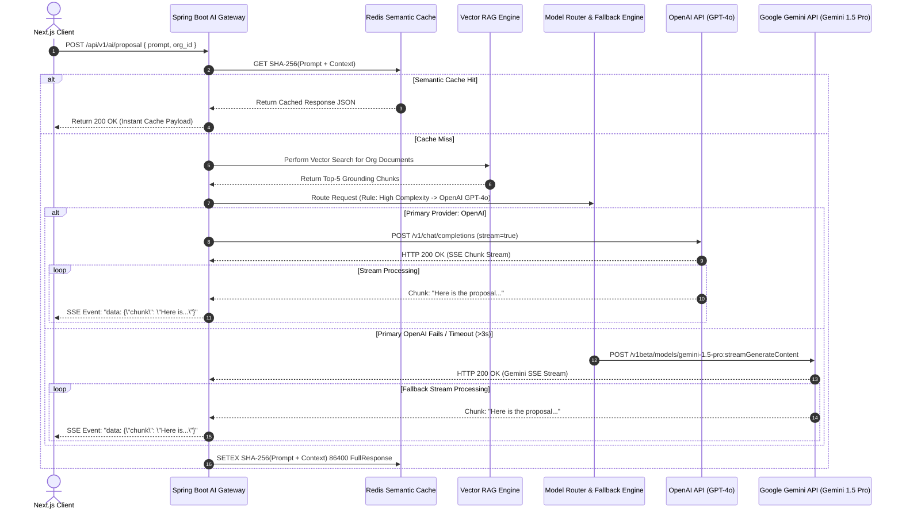

# Enterprise AI Gateway & Telemetry Architecture
## AI Agency Operating System (AgencyOS)

---

## 1. Purpose

This document details the AI Gateway topology, dynamic model routing heuristics, Server-Sent Events (SSE) streaming engine, prompt/response processing pipelines, Redis semantic caching layer, and Retrieval-Augmented Generation (RAG) architecture across OpenAI and Google Gemini.

---

## 2. High-Level AI Architecture & Streaming Pipeline

---

## 3. Business Rules & Model Selection Matrix

AgencyOS routes workloads dynamically based on task domain, context length requirements, reasoning complexity, and execution cost:

| Use Case Domain | Primary Model Engine | Secondary Fallback Model | Selection Rationale |
| :--- | :--- | :--- | :--- |
| **Proposal Generator** | OpenAI `gpt-4o` | Google Gemini `gemini-1.5-pro` | High formatting accuracy & sales persuasive tone |
| **Statement of Work (SOW)** | OpenAI `gpt-4o` | Google Gemini `gemini-1.5-pro` | Strict legal clause structure compliance |
| **Contract Generator** | OpenAI `o3-mini` | OpenAI `gpt-4o` | Advanced legal logic reasoning & zero hallucination |
| **Invoice Generator** | Google Gemini `gemini-2.0-flash` | OpenAI `gpt-4o-mini` | Low latency structured JSON generation |
| **Meeting Minutes** | Google Gemini `gemini-1.5-pro` | OpenAI `gpt-4o` | 1M+ token context window for long audio transcripts |
| **Follow-up Email** | Google Gemini `gemini-2.0-flash` | OpenAI `gpt-4o-mini` | Sub-150ms TTFT response for real-time UI typing |
| **Jira Story Generator** | OpenAI `gpt-4o` | Google Gemini `gemini-1.5-pro` | Accurate ADF JSON format & Acceptance Criteria |
| **Interactive Chat Assistant**| OpenAI `gpt-4o` | Google Gemini `gemini-2.0-flash` | Superior multi-turn conversational flow |
| **Document Summarization** | Google Gemini `gemini-1.5-pro` | OpenAI `gpt-4o` | Massive context processing efficiency |
| **Code Generation** | OpenAI `o3-mini` | Google Gemini `gemini-1.5-pro` | High accuracy Java & TypeScript code synthesis |
| **Document Extraction** | Google Gemini `gemini-2.0-flash` | OpenAI `gpt-4o-mini` | Fast PDF OCR & key-value pair parsing |
| **JSON Generation** | OpenAI `gpt-4o` (Structured Output)| Google Gemini `gemini-1.5-pro` | Native JSON Schema mode enforcement |

---

## 4. Redis Semantic & Prompt Caching Strategy

1. **Exact Prompt Caching**: Key = `cache:ai:exact:{SHA256(system_prompt + user_prompt + context)}`. Expiration: 24 Hours.
2. **Semantic Caching**: RedisSearch index comparing cosine similarity of incoming prompt embeddings against cached queries. Threshold: `similarity >= 0.96`.
3. **Cache Eviction**: Automatic eviction on multi-tenant document deletion or organization model settings modification.
