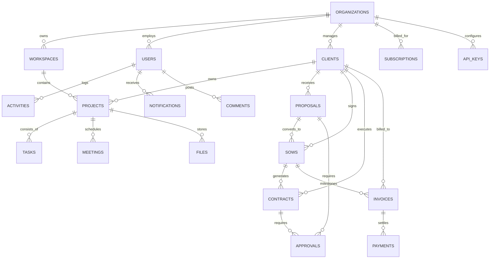

# Enterprise PostgreSQL Database Schema Specification
## AI Agency Operating System (AgencyOS)

---

## 1. Entity Relationship (ER) Diagram



---

## 2. PostgreSQL Enums

```sql
CREATE TYPE user_role_enum AS ENUM (
    'SUPER_ADMIN', 
    'AGENCY_OWNER', 
    'AGENCY_ADMIN', 
    'PROJECT_MANAGER', 
    'DEVELOPER', 
    'QA_ENGINEER', 
    'FINANCE_MANAGER', 
    'CLIENT_USER'
);

CREATE TYPE plan_tier_enum AS ENUM (
    'STARTER', 
    'PROFESSIONAL', 
    'AGENCY_SCALE', 
    'ENTERPRISE'
);

CREATE TYPE doc_status_enum AS ENUM (
    'DRAFT', 
    'PENDING_REVIEW', 
    'APPROVED', 
    'SENT_TO_CLIENT', 
    'SIGNED', 
    'REJECTED', 
    'EXPIRED'
);

CREATE TYPE payment_status_enum AS ENUM (
    'PENDING', 
    'PROCESSING', 
    'PAID', 
    'FAILED', 
    'REFUNDED'
);

CREATE TYPE task_priority_enum AS ENUM (
    'LOW', 
    'MEDIUM', 
    'HIGH', 
    'URGENT'
);

CREATE TYPE ai_provider_enum AS ENUM (
    'ANTHROPIC', 
    'OPENAI', 
    'GOOGLE_GEMINI'
);
```

---

## 3. Comprehensive DDL Table Definitions (27 Tables)

### Table 1: `organizations` (Tenants)
```sql
CREATE TABLE organizations (
    id UUID PRIMARY KEY DEFAULT gen_random_uuid(),
    name VARCHAR(255) NOT NULL,
    slug VARCHAR(100) UNIQUE NOT NULL,
    logo_url TEXT,
    custom_domain VARCHAR(255),
    plan_tier plan_tier_enum DEFAULT 'STARTER',
    stripe_customer_id VARCHAR(100) UNIQUE,
    metadata JSONB DEFAULT '{}'::jsonb,
    is_deleted BOOLEAN DEFAULT FALSE,
    deleted_at TIMESTAMPTZ,
    created_at TIMESTAMPTZ DEFAULT NOW(),
    updated_at TIMESTAMPTZ DEFAULT NOW()
);
CREATE INDEX idx_orgs_slug ON organizations(slug);
```

### Table 2: `workspaces`
```sql
CREATE TABLE workspaces (
    id UUID PRIMARY KEY DEFAULT gen_random_uuid(),
    organization_id UUID NOT NULL REFERENCES organizations(id) ON DELETE CASCADE,
    name VARCHAR(255) NOT NULL,
    code VARCHAR(50) NOT NULL,
    description TEXT,
    is_default BOOLEAN DEFAULT FALSE,
    is_deleted BOOLEAN DEFAULT FALSE,
    deleted_at TIMESTAMPTZ,
    created_at TIMESTAMPTZ DEFAULT NOW(),
    updated_at TIMESTAMPTZ DEFAULT NOW(),
    UNIQUE(organization_id, code)
);
CREATE INDEX idx_workspaces_org ON workspaces(organization_id);
```

### Table 3: `users`
```sql
CREATE TABLE users (
    id UUID PRIMARY KEY DEFAULT gen_random_uuid(),
    organization_id UUID NOT NULL REFERENCES organizations(id) ON DELETE CASCADE,
    email VARCHAR(255) UNIQUE NOT NULL,
    password_hash VARCHAR(255),
    first_name VARCHAR(100),
    last_name VARCHAR(100),
    avatar_url TEXT,
    phone_number VARCHAR(50),
    is_active BOOLEAN DEFAULT TRUE,
    mfa_enabled BOOLEAN DEFAULT FALSE,
    mfa_secret VARCHAR(255),
    is_deleted BOOLEAN DEFAULT FALSE,
    deleted_at TIMESTAMPTZ,
    created_at TIMESTAMPTZ DEFAULT NOW(),
    updated_at TIMESTAMPTZ DEFAULT NOW()
);
CREATE INDEX idx_users_org_email ON users(organization_id, email);
```

### Table 4: `roles`
```sql
CREATE TABLE roles (
    id UUID PRIMARY KEY DEFAULT gen_random_uuid(),
    organization_id UUID REFERENCES organizations(id) ON DELETE CASCADE,
    name VARCHAR(100) NOT NULL,
    code user_role_enum NOT NULL,
    description TEXT,
    is_system BOOLEAN DEFAULT FALSE,
    created_at TIMESTAMPTZ DEFAULT NOW(),
    updated_at TIMESTAMPTZ DEFAULT NOW()
);
```

### Table 5: `permissions`
```sql
CREATE TABLE permissions (
    id UUID PRIMARY KEY DEFAULT gen_random_uuid(),
    resource VARCHAR(100) NOT NULL,
    action VARCHAR(50) NOT NULL,
    description TEXT,
    created_at TIMESTAMPTZ DEFAULT NOW(),
    UNIQUE(resource, action)
);
```

### Table 6: `role_permissions` (M:N)
```sql
CREATE TABLE role_permissions (
    role_id UUID NOT NULL REFERENCES roles(id) ON DELETE CASCADE,
    permission_id UUID NOT NULL REFERENCES permissions(id) ON DELETE CASCADE,
    PRIMARY KEY (role_id, permission_id)
);
```

### Table 7: `user_roles` (M:N)
```sql
CREATE TABLE user_roles (
    user_id UUID NOT NULL REFERENCES users(id) ON DELETE CASCADE,
    role_id UUID NOT NULL REFERENCES roles(id) ON DELETE CASCADE,
    PRIMARY KEY (user_id, role_id)
);
```

### Table 8: `clients`
```sql
CREATE TABLE clients (
    id UUID PRIMARY KEY DEFAULT gen_random_uuid(),
    organization_id UUID NOT NULL REFERENCES organizations(id) ON DELETE CASCADE,
    company_name VARCHAR(255) NOT NULL,
    primary_contact_name VARCHAR(255),
    primary_email VARCHAR(255) NOT NULL,
    phone VARCHAR(50),
    website TEXT,
    billing_address TEXT,
    currency VARCHAR(10) DEFAULT 'USD',
    is_active BOOLEAN DEFAULT TRUE,
    is_deleted BOOLEAN DEFAULT FALSE,
    deleted_at TIMESTAMPTZ,
    created_at TIMESTAMPTZ DEFAULT NOW(),
    updated_at TIMESTAMPTZ DEFAULT NOW()
);
CREATE INDEX idx_clients_org ON clients(organization_id);
```

### Table 9: `projects`
```sql
CREATE TABLE projects (
    id UUID PRIMARY KEY DEFAULT gen_random_uuid(),
    organization_id UUID NOT NULL REFERENCES organizations(id) ON DELETE CASCADE,
    workspace_id UUID NOT NULL REFERENCES workspaces(id) ON DELETE CASCADE,
    client_id UUID NOT NULL REFERENCES clients(id) ON DELETE CASCADE,
    name VARCHAR(255) NOT NULL,
    code VARCHAR(50) NOT NULL,
    description TEXT,
    budget NUMERIC(15, 2),
    start_date DATE,
    target_end_date DATE,
    progress_percentage INT DEFAULT 0,
    status doc_status_enum DEFAULT 'DRAFT',
    is_deleted BOOLEAN DEFAULT FALSE,
    deleted_at TIMESTAMPTZ,
    created_at TIMESTAMPTZ DEFAULT NOW(),
    updated_at TIMESTAMPTZ DEFAULT NOW()
);
CREATE INDEX idx_projects_org_workspace ON projects(organization_id, workspace_id);
```

### Table 10: `tasks`
```sql
CREATE TABLE tasks (
    id UUID PRIMARY KEY DEFAULT gen_random_uuid(),
    organization_id UUID NOT NULL REFERENCES organizations(id) ON DELETE CASCADE,
    project_id UUID NOT NULL REFERENCES projects(id) ON DELETE CASCADE,
    title VARCHAR(255) NOT NULL,
    description TEXT,
    priority task_priority_enum DEFAULT 'MEDIUM',
    status VARCHAR(50) DEFAULT 'TODO',
    assignee_id UUID REFERENCES users(id),
    due_date TIMESTAMPTZ,
    story_points INT DEFAULT 1,
    is_deleted BOOLEAN DEFAULT FALSE,
    deleted_at TIMESTAMPTZ,
    created_at TIMESTAMPTZ DEFAULT NOW(),
    updated_at TIMESTAMPTZ DEFAULT NOW()
);
CREATE INDEX idx_tasks_project ON tasks(project_id);
```

### Table 11: `meetings`
```sql
CREATE TABLE meetings (
    id UUID PRIMARY KEY DEFAULT gen_random_uuid(),
    organization_id UUID NOT NULL REFERENCES organizations(id) ON DELETE CASCADE,
    project_id UUID REFERENCES projects(id) ON DELETE CASCADE,
    title VARCHAR(255) NOT NULL,
    raw_transcript TEXT,
    summary_markdown TEXT,
    action_items JSONB DEFAULT '[]'::jsonb,
    scheduled_at TIMESTAMPTZ,
    duration_minutes INT,
    created_by UUID REFERENCES users(id),
    created_at TIMESTAMPTZ DEFAULT NOW()
);
```

### Table 12: `proposals`
```sql
CREATE TABLE proposals (
    id UUID PRIMARY KEY DEFAULT gen_random_uuid(),
    organization_id UUID NOT NULL REFERENCES organizations(id) ON DELETE CASCADE,
    client_id UUID REFERENCES clients(id) ON DELETE SET NULL,
    title VARCHAR(255) NOT NULL,
    target_budget NUMERIC(15, 2),
    timeline_weeks VARCHAR(100),
    requirements_text TEXT,
    content_markdown TEXT NOT NULL,
    pdf_url TEXT,
    status doc_status_enum DEFAULT 'DRAFT',
    created_by UUID REFERENCES users(id),
    is_deleted BOOLEAN DEFAULT FALSE,
    deleted_at TIMESTAMPTZ,
    created_at TIMESTAMPTZ DEFAULT NOW(),
    updated_at TIMESTAMPTZ DEFAULT NOW()
);
CREATE INDEX idx_proposals_org_client ON proposals(organization_id, client_id);
```

### Table 13: `sows` (Statements of Work)
```sql
CREATE TABLE sows (
    id UUID PRIMARY KEY DEFAULT gen_random_uuid(),
    organization_id UUID NOT NULL REFERENCES organizations(id) ON DELETE CASCADE,
    proposal_id UUID REFERENCES proposals(id) ON DELETE SET NULL,
    client_id UUID NOT NULL REFERENCES clients(id) ON DELETE CASCADE,
    title VARCHAR(255) NOT NULL,
    sow_number VARCHAR(100) UNIQUE NOT NULL,
    scope_deliverables JSONB DEFAULT '[]'::jsonb,
    total_value NUMERIC(15, 2) NOT NULL,
    status doc_status_enum DEFAULT 'DRAFT',
    created_at TIMESTAMPTZ DEFAULT NOW(),
    updated_at TIMESTAMPTZ DEFAULT NOW()
);
```

### Table 14: `contracts`
```sql
CREATE TABLE contracts (
    id UUID PRIMARY KEY DEFAULT gen_random_uuid(),
    organization_id UUID NOT NULL REFERENCES organizations(id) ON DELETE CASCADE,
    sow_id UUID REFERENCES sows(id) ON DELETE SET NULL,
    client_id UUID NOT NULL REFERENCES clients(id) ON DELETE CASCADE,
    contract_number VARCHAR(100) UNIQUE NOT NULL,
    ip_clause_type VARCHAR(255),
    governing_law VARCHAR(255),
    content_markdown TEXT NOT NULL,
    esign_status doc_status_enum DEFAULT 'DRAFT',
    esign_url TEXT,
    signed_at TIMESTAMPTZ,
    created_at TIMESTAMPTZ DEFAULT NOW()
);
```

### Table 15: `invoices`
```sql
CREATE TABLE invoices (
    id UUID PRIMARY KEY DEFAULT gen_random_uuid(),
    organization_id UUID NOT NULL REFERENCES organizations(id) ON DELETE CASCADE,
    client_id UUID NOT NULL REFERENCES clients(id) ON DELETE CASCADE,
    sow_id UUID REFERENCES sows(id) ON DELETE SET NULL,
    invoice_number VARCHAR(100) UNIQUE NOT NULL,
    subtotal NUMERIC(15, 2) NOT NULL,
    tax_amount NUMERIC(15, 2) DEFAULT 0,
    total_amount NUMERIC(15, 2) NOT NULL,
    due_date DATE NOT NULL,
    status payment_status_enum DEFAULT 'PENDING',
    stripe_invoice_id VARCHAR(255),
    created_at TIMESTAMPTZ DEFAULT NOW()
);
CREATE INDEX idx_invoices_org ON invoices(organization_id);
```

### Table 16: `invoice_line_items`
```sql
CREATE TABLE invoice_line_items (
    id UUID PRIMARY KEY DEFAULT gen_random_uuid(),
    invoice_id UUID NOT NULL REFERENCES invoices(id) ON DELETE CASCADE,
    description TEXT NOT NULL,
    quantity NUMERIC(10, 2) DEFAULT 1,
    unit_rate NUMERIC(15, 2) NOT NULL,
    total_amount NUMERIC(15, 2) NOT NULL
);
```

### Table 17: `billing_profiles`
```sql
CREATE TABLE billing_profiles (
    id UUID PRIMARY KEY DEFAULT gen_random_uuid(),
    organization_id UUID UNIQUE NOT NULL REFERENCES organizations(id) ON DELETE CASCADE,
    stripe_customer_id VARCHAR(255) UNIQUE,
    billing_email VARCHAR(255) NOT NULL,
    vat_number VARCHAR(100),
    payment_method_last4 VARCHAR(4),
    created_at TIMESTAMPTZ DEFAULT NOW()
);
```

### Table 18: `subscriptions`
```sql
CREATE TABLE subscriptions (
    id UUID PRIMARY KEY DEFAULT gen_random_uuid(),
    organization_id UUID NOT NULL REFERENCES organizations(id) ON DELETE CASCADE,
    stripe_subscription_id VARCHAR(255) UNIQUE,
    plan_tier plan_tier_enum NOT NULL,
    current_period_start TIMESTAMPTZ NOT NULL,
    current_period_end TIMESTAMPTZ NOT NULL,
    is_active BOOLEAN DEFAULT TRUE,
    cancel_at_period_end BOOLEAN DEFAULT FALSE,
    created_at TIMESTAMPTZ DEFAULT NOW()
);
```

### Table 19: `payments`
```sql
CREATE TABLE payments (
    id UUID PRIMARY KEY DEFAULT gen_random_uuid(),
    organization_id UUID NOT NULL REFERENCES organizations(id) ON DELETE CASCADE,
    invoice_id UUID REFERENCES invoices(id) ON DELETE SET NULL,
    amount NUMERIC(15, 2) NOT NULL,
    currency VARCHAR(10) DEFAULT 'USD',
    payment_status payment_status_enum DEFAULT 'PROCESSING',
    stripe_payment_intent_id VARCHAR(255) UNIQUE,
    created_at TIMESTAMPTZ DEFAULT NOW()
);
```

### Table 20: `notifications`
```sql
CREATE TABLE notifications (
    id UUID PRIMARY KEY DEFAULT gen_random_uuid(),
    organization_id UUID NOT NULL REFERENCES organizations(id) ON DELETE CASCADE,
    user_id UUID NOT NULL REFERENCES users(id) ON DELETE CASCADE,
    title VARCHAR(255) NOT NULL,
    message TEXT NOT NULL,
    type VARCHAR(50) NOT NULL,
    is_read BOOLEAN DEFAULT FALSE,
    created_at TIMESTAMPTZ DEFAULT NOW()
);
CREATE INDEX idx_notifs_user ON notifications(user_id, is_read);
```

### Table 21: `activities` (Activity Feed)
```sql
CREATE TABLE activities (
    id UUID PRIMARY KEY DEFAULT gen_random_uuid(),
    organization_id UUID NOT NULL REFERENCES organizations(id) ON DELETE CASCADE,
    user_id UUID REFERENCES users(id) ON DELETE SET NULL,
    action VARCHAR(100) NOT NULL,
    entity_type VARCHAR(100) NOT NULL,
    entity_id UUID NOT NULL,
    metadata JSONB DEFAULT '{}'::jsonb,
    created_at TIMESTAMPTZ DEFAULT NOW()
);
```

### Table 22: `ai_usage_logs`
```sql
CREATE TABLE ai_usage_logs (
    id UUID PRIMARY KEY DEFAULT gen_random_uuid(),
    organization_id UUID NOT NULL REFERENCES organizations(id) ON DELETE CASCADE,
    user_id UUID REFERENCES users(id) ON DELETE SET NULL,
    provider ai_provider_enum NOT NULL,
    model_name VARCHAR(100) NOT NULL,
    prompt_tokens INT NOT NULL,
    completion_tokens INT NOT NULL,
    total_tokens INT NOT NULL,
    estimated_cost_usd NUMERIC(10, 6),
    created_at TIMESTAMPTZ DEFAULT NOW()
);
CREATE INDEX idx_ai_usage_org ON ai_usage_logs(organization_id, created_at);
```

### Table 23: `audit_logs` (SOC2 Compliance)
```sql
CREATE TABLE audit_logs (
    id UUID PRIMARY KEY DEFAULT gen_random_uuid(),
    organization_id UUID NOT NULL REFERENCES organizations(id) ON DELETE CASCADE,
    user_id UUID REFERENCES users(id) ON DELETE SET NULL,
    ip_address VARCHAR(50),
    user_agent TEXT,
    action VARCHAR(100) NOT NULL,
    resource VARCHAR(100) NOT NULL,
    changes JSONB DEFAULT '{}'::jsonb,
    created_at TIMESTAMPTZ DEFAULT NOW()
);
```

### Table 24: `integrations`
```sql
CREATE TABLE integrations (
    id UUID PRIMARY KEY DEFAULT gen_random_uuid(),
    organization_id UUID NOT NULL REFERENCES organizations(id) ON DELETE CASCADE,
    provider VARCHAR(100) NOT NULL,
    access_token_encrypted TEXT NOT NULL,
    refresh_token_encrypted TEXT,
    expires_at TIMESTAMPTZ,
    is_active BOOLEAN DEFAULT TRUE,
    created_at TIMESTAMPTZ DEFAULT NOW(),
    UNIQUE(organization_id, provider)
);
```

### Table 25: `api_keys` (BYOK Keys)
```sql
CREATE TABLE api_keys (
    id UUID PRIMARY KEY DEFAULT gen_random_uuid(),
    organization_id UUID NOT NULL REFERENCES organizations(id) ON DELETE CASCADE,
    provider ai_provider_enum NOT NULL,
    key_hash TEXT NOT NULL,
    key_encrypted TEXT NOT NULL,
    is_active BOOLEAN DEFAULT TRUE,
    created_at TIMESTAMPTZ DEFAULT NOW(),
    UNIQUE(organization_id, provider)
);
```

### Table 26: `prompt_templates`
```sql
CREATE TABLE prompt_templates (
    id UUID PRIMARY KEY DEFAULT gen_random_uuid(),
    organization_id UUID REFERENCES organizations(id) ON DELETE CASCADE,
    name VARCHAR(255) NOT NULL,
    category VARCHAR(100) NOT NULL,
    template_text TEXT NOT NULL,
    variables JSONB DEFAULT '[]'::jsonb,
    is_system BOOLEAN DEFAULT FALSE,
    created_at TIMESTAMPTZ DEFAULT NOW()
);
```

### Table 27: `files` (S3/R2 Metadata)
```sql
CREATE TABLE files (
    id UUID PRIMARY KEY DEFAULT gen_random_uuid(),
    organization_id UUID NOT NULL REFERENCES organizations(id) ON DELETE CASCADE,
    filename VARCHAR(255) NOT NULL,
    storage_key TEXT NOT NULL,
    mime_type VARCHAR(100),
    size_bytes BIGINT NOT NULL,
    uploaded_by UUID REFERENCES users(id),
    created_at TIMESTAMPTZ DEFAULT NOW()
);
```

---

## 4. Multi-Tenant Row-Level Security (RLS) Policy Example

```sql
-- Enable RLS on proposals
ALTER TABLE proposals ENABLE ROW LEVEL SECURITY;

-- Create policy for tenant isolation
CREATE POLICY tenant_isolation_policy ON proposals
    FOR ALL
    USING (organization_id = NULLIF(current_setting('app.current_tenant_id', true), '')::uuid);
```
