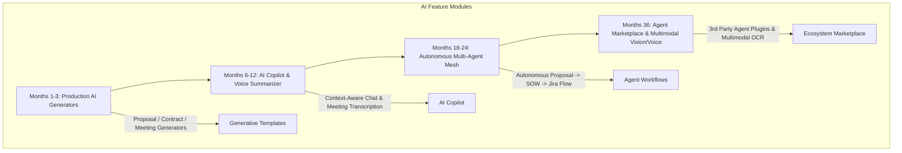

# LLM Platform Scaling, Vector RAG & Autonomous Agent Roadmap
## AI Agency Operating System (AgencyOS)

---

## 1. Purpose

This document details the AI platform scaling strategy, multi-provider model routing expansion, vector RAG scaling, semantic prompt caching, and AI product expansion (Autonomous Agents, Voice AI, Multimodal AI).

---

## 2. AI Product Expansion Horizon (Months 1–36)

---

## 3. AI Infrastructure Scaling Initiatives

| Horizon | AI Infrastructure Milestone | Technology Stack | Scaling KPI Target |
| :--- | :--- | :--- | :--- |
| **30 Days** | Semantic Response Caching | RedisSearch + Cosine Similarity Index | Cache Hit Ratio > 35% |
| **90 Days** | Multi-Provider Load Balancer | OpenAI + Gemini + Anthropic Fallback Mesh | Failover Latency < 1,000ms |
| **6 Months**| High-Scale Vector RAG Store | Distributed Qdrant / Pinecone Cluster | Query Latency < 50ms on 10M Vectors |
| **12 Months**| Fine-Tuned Domain LLMs | LLaMA 3 / Mistral Custom Fine-Tuned Models | 50% Reduction in Provider API Costs |
| **24 Months**| Autonomous Agent Mesh | LangGraph / AutoGen Multi-Agent Swarm | 80% Zero-Touch Proposal Generation |
