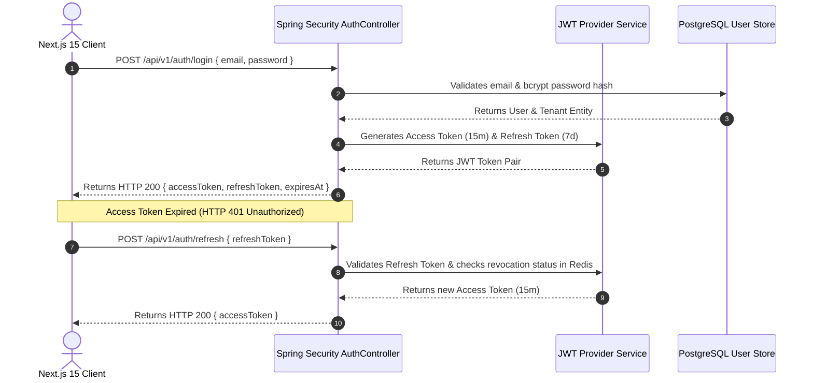

# Complete API Architecture & Integration Guide
## AI Agency Operating System (AgencyOS)

---

## 1. OpenAPI 3.1 & REST Standards

All APIs in **AgencyOS** conform to **OpenAPI 3.1.0** standards.
- Base URL (Production): `https://api.agencyos.io/api/v1`
- Base URL (Staging): `https://staging-api.agencyos.io/api/v1`
- Content Type: `application/json; charset=utf-8`

### Standard Response Structure

#### Success Response Envelope
```json
{
  "success": true,
  "data": { ... },
  "message": "Resource retrieved successfully",
  "timestamp": "2026-07-25T12:00:00Z"
}
```

#### Error Response Envelope (RFC 7807 Problem Details)
```json
{
  "success": false,
  "error": {
    "code": "VALIDATION_FAILED",
    "message": "Validation Error: Client Name is required.",
    "status": 400,
    "path": "/api/v1/proposals/generate",
    "timestamp": "2026-07-25T12:00:00Z",
    "details": [
      { "field": "clientName", "rejectedValue": "", "message": "Client Name must not be blank" }
    ]
  }
}
```

---

## 2. Authentication & JWT Refresh Token Flow



---

## 3. RBAC Authorization Matrix

| Role | Access Scope |
| :--- | :--- |
| `ROLE_ADMIN` | Full Tenant Admin privileges: Manage team roles, subscription billing, BYOK AI API keys, audit logs, and all CRUD features. |
| `ROLE_MANAGER` | Create, update, view proposals, legal contracts, invoices, client CRM, agile projects, and Jira story sync. Cannot alter team roles or API keys. |
| `ROLE_MEMBER` | Create/update proposals, view contracts, view/edit assigned agile projects, view client CRM. Read-only access to billing. |
| `ROLE_VIEWER` | Read-only access across proposals, projects, clients, and metrics. |

---

## 4. Frontend Axios & TanStack Query Integration Code

### Axios Client Interceptor (`lib/apiClient.ts`)

```typescript
import axios from "axios";

export const apiClient = axios.create({
  baseURL: process.env.NEXT_PUBLIC_API_BASE_URL || "https://api.agencyos.io/api/v1",
  timeout: 15000,
  headers: {
    "Content-Type": "application/json",
  },
});

// Request Interceptor: Attach Bearer Token
apiClient.interceptors.request.use(
  (config) => {
    const token = typeof window !== "undefined" ? localStorage.getItem("accessToken") : null;
    if (token) {
      config.headers.Authorization = `Bearer ${token}`;
    }
    return config;
  },
  (error) => Promise.reject(error)
);

// Response Interceptor: Handle Token Refresh & Retries
apiClient.interceptors.response.use(
  (response) => response,
  async (error) => {
    const originalRequest = error.config;
    if (error.response?.status === 401 && !originalRequest._retry) {
      originalRequest._retry = true;
      try {
        const refreshToken = localStorage.getItem("refreshToken");
        const res = await axios.post(`${apiClient.defaults.baseURL}/auth/refresh`, { refreshToken });
        const newAccessToken = res.data.accessToken;
        localStorage.setItem("accessToken", newAccessToken);
        originalRequest.headers.Authorization = `Bearer ${newAccessToken}`;
        return apiClient(originalRequest);
      } catch (refreshError) {
        localStorage.removeItem("accessToken");
        localStorage.removeItem("refreshToken");
        if (typeof window !== "undefined") window.location.href = "/auth/login";
        return Promise.reject(refreshError);
      }
    }
    return Promise.reject(error);
  }
);
```
