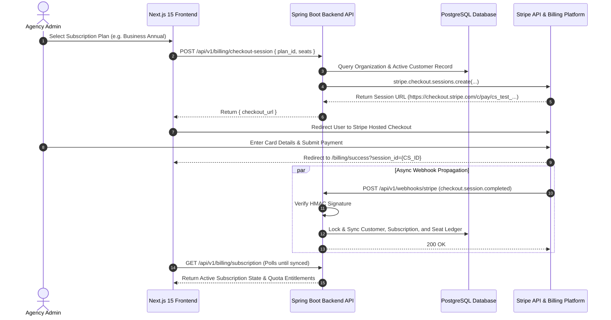

# Enterprise Billing Architecture & Integration Flows
## AI Agency Operating System (AgencyOS)

---

## 1. Purpose

The **Billing Architecture** defines the technical framework and end-to-end integration flows governing SaaS subscription management, checkout execution, automated renewals, tier upgrades/downgrades, cancellations, and account reactivations across AgencyOS.

---

## 2. Architecture & High-Level System Topology

AgencyOS uses **Stripe Hosted Checkout** and **Stripe Webhooks** as the source of truth for financial transactions, storing a mirrored multi-tenant state in PostgreSQL for sub-millisecond local authorization checks.

---

## 3. Business Rules

1. **Multi-Tenant Scoping**: Every Stripe `Customer` object is linked 1:1 to an AgencyOS `Organization` UUID via Stripe Customer Metadata (`org_id`).
2. **Immediate Upgrades**: Tier upgrades (e.g., Starter -> Business) apply immediately with prorated billing adjustments applied to the next invoice cycle.
3. **End-of-Period Downgrades**: Plan downgrades take effect at the end of the current billing cycle (`cancel_at_period_end = true`) to prevent resource disruption.
4. **Subscription Grace Period**: Subscriptions entering `past_due` status remain active for a 7-day grace period while Stripe Smart Retries run. If uncollected after 7 days, access is revoked (`unpaid`/`canceled`).
5. **Proration Policy**: Seat additions generate immediate prorated invoices. Seat removals reduce quantity at the next billing period renewal.

---

## 4. Data Flow & Integration Workflows

### A. Checkout Flow
1. User triggers plan selection on Next.js UI.
2. Spring Boot creates a Stripe `CheckoutSession` containing `customer`, `line_items` (Base Plan Price + Seat Price), `mode="subscription"`, `success_url`, `cancel_url`, and `metadata = { org_id, user_id }`.
3. Client redirects to Hosted Checkout.
4. Payment succeeds -> `checkout.session.completed` webhook fires -> DB transaction activates local subscription.

### B. Renewal Flow
1. Stripe automatically attempts recurring card charge at period end.
2. Fires `invoice.created` -> `invoice.finalized` -> `invoice.paid`.
3. Webhook listener processes `invoice.paid`, updates `current_period_end` in DB, and replenishes monthly AI credits.

### C. Cancellation Flow
1. User clicks "Cancel Subscription" via Customer Portal or UI.
2. Spring Boot calls `stripe.subscriptions.update(sub_id, { cancel_at_period_end: true })`.
3. Status changes to `active` with `cancel_at_period_end = true`. Local DB sets `cancel_at_period_end = true`.
4. At period expiration, Stripe emits `customer.subscription.deleted` -> Local DB transitions status to `canceled`.

### D. Upgrade & Downgrade Flow
1. **Upgrade**: API updates subscription line item `price_id` with `proration_behavior = "always_invoice"`. Invoice is generated and paid immediately.
2. **Downgrade**: API updates subscription schedule or sets pending update with `proration_behavior = "none"`.

### E. Reactivation Flow
1. Canceled or pending-cancel subscription can be reactivated before period end.
2. API calls `stripe.subscriptions.update(sub_id, { cancel_at_period_end: false })`.
3. Local DB clears cancellation flag.

---

## 5. Error Handling

- **Stripe API Timeouts**: Retried automatically with exponential backoff using `Stripe.setAppInfo()` and configured idempotency keys.
- **Card Processing Failures**: Handled via `invoice.payment_failed` webhook. Directs user to Customer Portal to update card details.
- **Webhook Signature Failure**: Returns HTTP 400 Bad Request immediately and logs security event.

---

## 6. Security

- **SAQ A Compliance**: No credit card numbers (PAN) or CVV codes touch AgencyOS servers.
- **JWT Authorization**: All checkout and portal session APIs require an authenticated JWT token with `ROLE_ORG_ADMIN` authority.
- **Signature Verification**: Webhooks validate `Stripe-Signature` using `Webhook.constructEvent(payload, sigHeader, secret)`.

---

## 7. Testing

- Automated integration tests run using **Stripe Mock** and test card numbers (e.g. `4242 4242 4242 4242`).
- Webhook endpoints tested locally using `stripe listen --forward-to localhost:8080/api/v1/webhooks/stripe`.

---

## 8. Monitoring

- Prometheus Metric: `billing_checkout_sessions_created_total{plan_id}`
- Prometheus Metric: `billing_subscription_status_count{status}`
- Alertmanager Alert: `CheckoutSessionErrorRateHigh` (> 5% failures in 5m).

---

## 9. Deployment

- **Environment Variables**: `STRIPE_PUBLISHABLE_KEY`, `STRIPE_SECRET_KEY`, `STRIPE_WEBHOOK_SECRET`.
- Production keys stored in AWS Secrets Manager / Railway Encrypted Variables.

---

## 10. Best Practices

- **Source of Truth**: Always treat Stripe API and Webhook events as the single source of truth for billing state.
- **Idempotent Webhooks**: Wrap all database operations in idempotent transactions based on `event.getId()`.
