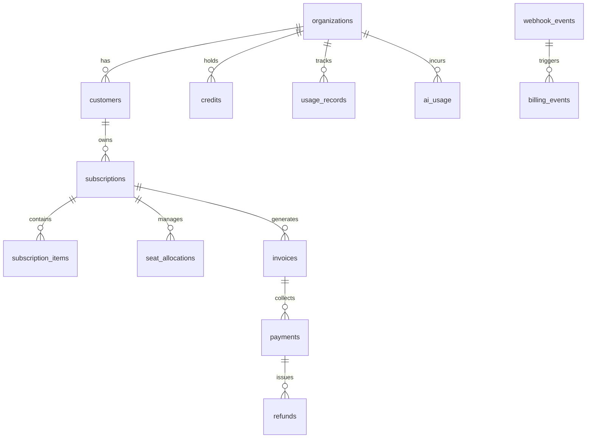

# Billing Database Schema Specification
## AI Agency Operating System (AgencyOS)

---

## 1. Purpose

This document defines the relational PostgreSQL database schema (`V4__stripe_billing_schema.sql`) for managing multi-tenant customer accounts, subscription states, usage tracking ledgers, invoices, payments, seat allocations, and webhook event logs.

---

## 2. Entity Relationship Diagram & Schema Topology



---

## 3. PostgreSQL DDL Schema Definitions

```sql
-- 1. Customers Table
CREATE TABLE customers (
    id UUID PRIMARY KEY DEFAULT gen_random_uuid(),
    org_id UUID NOT NULL UNIQUE REFERENCES organizations(id) ON DELETE CASCADE,
    stripe_customer_id VARCHAR(255) NOT NULL UNIQUE,
    email VARCHAR(255) NOT NULL,
    name VARCHAR(255),
    currency VARCHAR(3) DEFAULT 'USD',
    delinquent BOOLEAN DEFAULT FALSE,
    created_at TIMESTAMP WITH TIME ZONE DEFAULT CURRENT_TIMESTAMP,
    updated_at TIMESTAMP WITH TIME ZONE DEFAULT CURRENT_TIMESTAMP
);

-- 2. Subscriptions Table
CREATE TABLE subscriptions (
    id UUID PRIMARY KEY DEFAULT gen_random_uuid(),
    customer_id UUID NOT NULL REFERENCES customers(id) ON DELETE CASCADE,
    stripe_subscription_id VARCHAR(255) NOT NULL UNIQUE,
    plan_id VARCHAR(100) NOT NULL,
    status VARCHAR(50) NOT NULL, -- trialing, active, past_due, canceled, unpaid
    current_period_start TIMESTAMP WITH TIME ZONE NOT NULL,
    current_period_end TIMESTAMP WITH TIME ZONE NOT NULL,
    cancel_at_period_end BOOLEAN DEFAULT FALSE,
    canceled_at TIMESTAMP WITH TIME ZONE,
    trial_start TIMESTAMP WITH TIME ZONE,
    trial_end TIMESTAMP WITH TIME ZONE,
    created_at TIMESTAMP WITH TIME ZONE DEFAULT CURRENT_TIMESTAMP,
    updated_at TIMESTAMP WITH TIME ZONE DEFAULT CURRENT_TIMESTAMP
);

-- 3. Subscription Items Table (Seats, Add-ons)
CREATE TABLE subscription_items (
    id UUID PRIMARY KEY DEFAULT gen_random_uuid(),
    subscription_id UUID NOT NULL REFERENCES subscriptions(id) ON DELETE CASCADE,
    stripe_item_id VARCHAR(255) NOT NULL UNIQUE,
    stripe_price_id VARCHAR(255) NOT NULL,
    item_type VARCHAR(50) NOT NULL, -- base_plan, extra_seat, ai_pack
    quantity INT NOT NULL DEFAULT 1,
    unit_amount_cents BIGINT NOT NULL,
    created_at TIMESTAMP WITH TIME ZONE DEFAULT CURRENT_TIMESTAMP
);

-- 4. Invoices Table
CREATE TABLE invoices (
    id UUID PRIMARY KEY DEFAULT gen_random_uuid(),
    customer_id UUID NOT NULL REFERENCES customers(id),
    stripe_invoice_id VARCHAR(255) NOT NULL UNIQUE,
    number VARCHAR(100),
    status VARCHAR(50) NOT NULL, -- draft, open, paid, void, uncollectible
    amount_due_cents BIGINT NOT NULL,
    amount_paid_cents BIGINT NOT NULL,
    subtotal_cents BIGINT NOT NULL,
    tax_cents BIGINT DEFAULT 0,
    currency VARCHAR(3) NOT NULL,
    hosted_invoice_url TEXT,
    invoice_pdf_url TEXT,
    created_at TIMESTAMP WITH TIME ZONE NOT NULL
);

-- 5. Payments Table
CREATE TABLE payments (
    id UUID PRIMARY KEY DEFAULT gen_random_uuid(),
    invoice_id UUID REFERENCES invoices(id),
    customer_id UUID NOT NULL REFERENCES customers(id),
    stripe_payment_intent_id VARCHAR(255) NOT NULL UNIQUE,
    amount_cents BIGINT NOT NULL,
    currency VARCHAR(3) NOT NULL,
    status VARCHAR(50) NOT NULL, -- succeeded, failed, pending
    failure_reason TEXT,
    created_at TIMESTAMP WITH TIME ZONE DEFAULT CURRENT_TIMESTAMP
);

-- 6. Refunds Table
CREATE TABLE refunds (
    id UUID PRIMARY KEY DEFAULT gen_random_uuid(),
    payment_id UUID NOT NULL REFERENCES payments(id),
    stripe_refund_id VARCHAR(255) NOT NULL UNIQUE,
    amount_cents BIGINT NOT NULL,
    reason VARCHAR(100),
    status VARCHAR(50) NOT NULL,
    created_at TIMESTAMP WITH TIME ZONE DEFAULT CURRENT_TIMESTAMP
);

-- 7. Credits Ledger Table
CREATE TABLE credits (
    id UUID PRIMARY KEY DEFAULT gen_random_uuid(),
    org_id UUID NOT NULL REFERENCES organizations(id),
    credit_type VARCHAR(50) NOT NULL, -- ai_tokens, plan_discount
    balance_tokens BIGINT NOT NULL DEFAULT 0,
    created_at TIMESTAMP WITH TIME ZONE DEFAULT CURRENT_TIMESTAMP,
    updated_at TIMESTAMP WITH TIME ZONE DEFAULT CURRENT_TIMESTAMP
);

-- 8. Coupons Table
CREATE TABLE coupons (
    id UUID PRIMARY KEY DEFAULT gen_random_uuid(),
    stripe_coupon_id VARCHAR(255) NOT NULL UNIQUE,
    name VARCHAR(255) NOT NULL,
    percent_off DECIMAL(5,2),
    amount_off_cents BIGINT,
    duration VARCHAR(50) NOT NULL, -- once, repeating, forever
    created_at TIMESTAMP WITH TIME ZONE DEFAULT CURRENT_TIMESTAMP
);

-- 9. Usage Records Table
CREATE TABLE usage_records (
    id UUID PRIMARY KEY DEFAULT gen_random_uuid(),
    org_id UUID NOT NULL REFERENCES organizations(id),
    metric_name VARCHAR(100) NOT NULL, -- ai_tokens, api_calls, storage_bytes
    quantity BIGINT NOT NULL,
    timestamp TIMESTAMP WITH TIME ZONE DEFAULT CURRENT_TIMESTAMP,
    synced_to_stripe BOOLEAN DEFAULT FALSE
);

-- 10. Billing Events Audit Log
CREATE TABLE billing_events (
    id UUID PRIMARY KEY DEFAULT gen_random_uuid(),
    org_id UUID NOT NULL REFERENCES organizations(id),
    event_type VARCHAR(100) NOT NULL,
    description TEXT NOT NULL,
    metadata JSONB,
    created_at TIMESTAMP WITH TIME ZONE DEFAULT CURRENT_TIMESTAMP
);

-- 11. Webhook Events Table (Idempotency Engine)
CREATE TABLE webhook_events (
    id UUID PRIMARY KEY DEFAULT gen_random_uuid(),
    stripe_event_id VARCHAR(255) NOT NULL UNIQUE,
    event_type VARCHAR(100) NOT NULL,
    payload JSONB NOT NULL,
    status VARCHAR(50) NOT NULL, -- PENDING, PROCESSED, FAILED
    error_message TEXT,
    processed_at TIMESTAMP WITH TIME ZONE,
    created_at TIMESTAMP WITH TIME ZONE DEFAULT CURRENT_TIMESTAMP
);

-- 12. Seat Allocations Table
CREATE TABLE seat_allocations (
    id UUID PRIMARY KEY DEFAULT gen_random_uuid(),
    org_id UUID NOT NULL REFERENCES organizations(id),
    user_id UUID NOT NULL REFERENCES users(id),
    seat_type VARCHAR(50) DEFAULT 'STANDARD',
    assigned_at TIMESTAMP WITH TIME ZONE DEFAULT CURRENT_TIMESTAMP,
    UNIQUE(org_id, user_id)
);

-- 13. AI Usage Ledger
CREATE TABLE ai_usage (
    id UUID PRIMARY KEY DEFAULT gen_random_uuid(),
    org_id UUID NOT NULL REFERENCES organizations(id),
    user_id UUID NOT NULL REFERENCES users(id),
    model VARCHAR(100) NOT NULL,
    prompt_tokens INT NOT NULL,
    completion_tokens INT NOT NULL,
    cost_usd DECIMAL(10, 6) NOT NULL,
    created_at TIMESTAMP WITH TIME ZONE DEFAULT CURRENT_TIMESTAMP
);
```

---

## 4. Business Rules & Indexing Strategy

- Indexes created on `customers(org_id)`, `subscriptions(customer_id)`, `webhook_events(stripe_event_id)`, and `ai_usage(org_id, created_at)`.
- Foreign key constraints maintain cascade deletions on non-financial tenant records while preserving immutable audit logs for `invoices` and `payments`.
