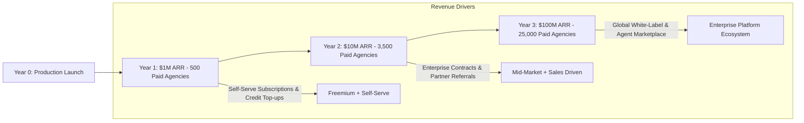

# Business Growth, Monetization & Expansion Strategy
## AI Agency Operating System (AgencyOS)

---

## 1. Purpose

This document specifies the monetization scaling roadmap, pricing evolution, usage-based billing expansions, enterprise sales enablement, partner referral programs, white-label options, and ARR revenue trajectories.

---

## 2. Revenue Scaling Trajectory & Financial Milestones

---

## 3. Pricing & Monetization Evolution Phases

| Milestone Horizon | Tier Pricing Model | Usage-Based Expansion | Target Customer Segment | Target ARR |
| :--- | :--- | :--- | :--- | :--- |
| **Months 1–6** | Starter ($49/mo), Pro ($99/mo), Business ($199/mo) | AI Credit Top-Up Packs ($50 / 500k tokens) | Freelancers & Small Agencies | $1,000,000 ARR |
| **Months 7–18** | Custom Enterprise Tier ($999+/mo) + Seat Addons | Metered AI Overage Billing ($0.10/10k credits) | Mid-Market Digital Agencies | $10,000,000 ARR |
| **Months 19–36**| White-Label Agency License ($2,500+/mo) | Marketplace Revenue Share (20% fee) | Global Agency Networks & Franchises | $100,000,000 ARR |

---

## 4. Key Business Growth Initiatives

### Initiative 1: Agency Partner & Referral Program (Month 3)
- **Purpose**: Incentivize digital marketing consultants and software agencies to refer AgencyOS to their client networks.
- **Priority**: P1 (High).
- **Owner**: Head of Growth & VP Sales.
- **Mechanics**: 20% recurring revenue share for 12 months on all referred paying tenant organizations.
- **Success Metric**: 25% of new monthly self-serve signups originate from partner referral links.
