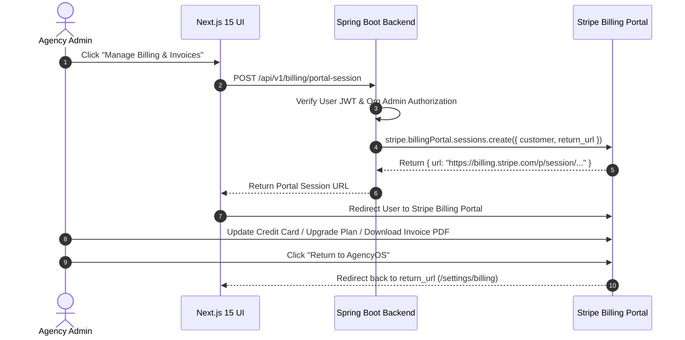

# Stripe Customer Portal Integration Guide
## AI Agency Operating System (AgencyOS)

---

## 1. Purpose

This document details the configuration and integration of the **Stripe Customer Portal** within AgencyOS, enabling self-service payment method updates, invoice downloads, subscription upgrades/downgrades, and cancellation management.

---

## 2. Customer Portal Workflow



---

## 3. Supported Self-Service Portal Features

1. **Payment Method Management**: Add, update, or remove credit card credentials. Set primary default card.
2. **Invoice & Billing History**: View past invoices, download receipt PDFs, view tax breakdowns.
3. **Plan Switching**: Self-service upgrade or downgrade between Starter, Professional, and Business tiers.
4. **Subscription Cancellation & Resumption**: Initiate end-of-period cancellation or undo pending cancellation.
5. **Tax ID & Billing Info**: Update corporate VAT/GST tax IDs and billing address.

---

## 4. Backend Portal Session Code Integration

```java
public String createCustomerPortalSession(UUID orgId, String returnUrl) throws StripeException {
    CustomerEntity customer = customerRepository.findByOrgId(orgId)
            .orElseThrow(() -> new EntityNotFoundException("Customer not found"));

    com.stripe.param.billingportal.SessionCreateParams params =
            com.stripe.param.billingportal.SessionCreateParams.builder()
                    .setCustomer(customer.getStripeCustomerId())
                    .setReturnUrl(returnUrl)
                    .build();

    com.stripe.model.billingportal.Session session = 
            com.stripe.model.billingportal.Session.create(params);

    return session.getUrl();
}
```

---

## 5. Security & Authorization Rules

- Only users with `ROLE_ORG_ADMIN` or `ROLE_BILLING_MANAGER` can initiate a Customer Portal session.
- Portal session URLs expire automatically after 5 minutes.
