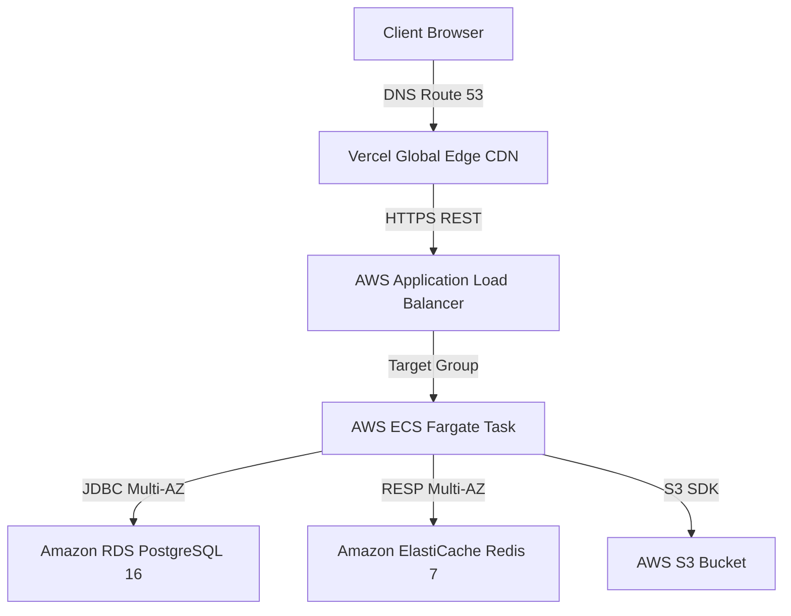

# Option B Enterprise Deployment Guide: Vercel + AWS ECS Fargate + RDS + ElastiCache
## AI Agency Operating System (AgencyOS)

---

## 1. Enterprise AWS Architecture Topology

Option B provides a SOC 2 / ISO 27001 compliant multi-AZ cloud architecture on Amazon Web Services:
- **Frontend App**: Deployed on **Vercel** with custom domain `agencyos.io` and Route 53 DNS.
- **Backend API Service**: Deployed on **AWS ECS Fargate** behind an Application Load Balancer (ALB).
- **Database**: **Amazon RDS PostgreSQL 16** (Multi-AZ Primary & Standby Replica).
- **Cache & Queue**: **Amazon ElastiCache Redis 7** (Multi-AZ Cluster).
- **CDN & Storage**: **Amazon CloudFront** + **AWS S3 Bucket**.
- **DNS & SSL**: **Amazon Route 53** + **AWS Certificate Manager (ACM)**.

---

## 2. Infrastructure Provisions

### A. AWS VPC & Security Groups
- VPC CIDR: `10.0.0.0/16`
- Public Subnets: `10.0.1.0/24`, `10.0.2.0/24` (ALB & NAT Gateways)
- Private App Subnets: `10.0.10.0/24`, `10.0.11.0/24` (ECS Fargate Tasks)
- Isolated DB Subnets: `10.0.20.0/24`, `10.0.21.0/24` (RDS & ElastiCache)

### B. Amazon ECS Fargate Task Configuration
- CPU: `1024` (1 vCPU), Memory: `2048` (2 GB)
- Minimum Tasks: 2 (Multi-AZ), Maximum Tasks: 10
- Auto-Scaling Target: CPU Utilization $> 70\%$ or Memory $> 80\%$
