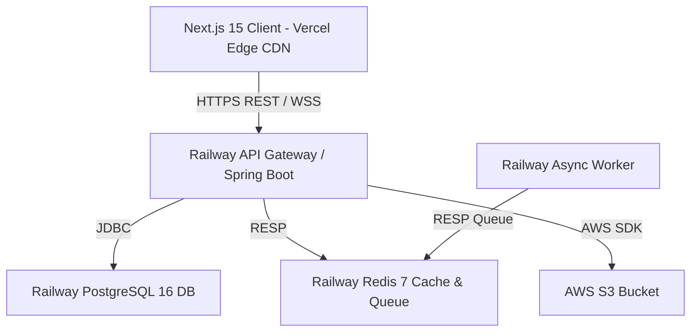

# Option A Production Deployment Guide: Vercel + Railway + AWS S3
## AI Agency Operating System (AgencyOS)

---

## 1. Deployment Architecture Overview

Option A offers an agile, cost-optimized production topology:
- **Frontend App**: Deployed on **Vercel** with Global Edge Network CDN.
- **Backend Service**: Deployed on **Railway** (Spring Boot 3.2 Java 21 container).
- **Background Worker**: Deployed on **Railway Worker Service** (Async Redis Queue Processor).
- **Database**: **Railway PostgreSQL 16** (Managed Instance).
- **Cache & Queue**: **Railway Redis 7** (Managed Cluster).
- **Storage**: **AWS S3** (Encrypted contract PDF and asset store).

---

## 2. Step-by-Step Deployment Guide

### A. Railway Database & Redis Setup
1. Create project `agencyos-prod` in Railway.
2. Provision **PostgreSQL 16**:
   - Connection URL: `jdbc:postgresql://${PGHOST}:${PGPORT}/${PGDATABASE}?sslmode=require`
3. Provision **Redis 7**:
   - Connection URL: `redis://:${REDISPASSWORD}@${REDISHOST}:${REDISPORT}`

### B. Railway Spring Boot App Deployment
1. Connect GitHub Repository `Vinod-Nex/AI-Agency-Operating-System`.
2. Build Command: `mvn clean package -DskipTests`
3. Start Command: `java -jar target/ai-agency-operating-system-0.1.0.jar`
4. Custom Domain: `api.agencyos.io` (Auto SSL via Railway).

### C. Vercel Frontend Deployment
1. Import GitHub Repository into Vercel.
2. Build Command: `npm run build`
3. Framework Preset: Next.js
4. Custom Domain: `agencyos.io`

---

## 3. Health Checks & Verification

- **Vercel Health**: `GET https://agencyos.io/` -> HTTP 200
- **Railway Backend Health**: `GET https://api.agencyos.io/actuator/health` -> `{"status": "UP"}`
