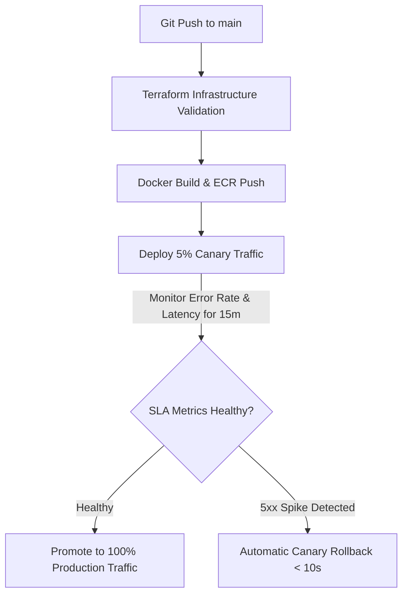

# DevOps, GitOps & Progressive Delivery Maturity Roadmap
## AI Agency Operating System (AgencyOS)

---

## 1. Purpose

This document outlines the evolution of DevOps automation: Infrastructure as Code (Terraform), GitOps deployment engines, progressive delivery (Canary & Blue-Green releases), and feature flag orchestration.

---

## 2. Progressive Delivery & Deployment Pipeline

---

## 3. Deployment Strategy Evolution

- **Months 1–3**: Standard Blue-Green Deployment using Vercel & Railway CLI.
- **Months 4–12**: GitOps automated deployments via ArgoCD + Terraform Cloud.
- **Months 13–36**: Progressive Canary Releases using Flagger + Istio Mesh with automated metric rollback triggers.
