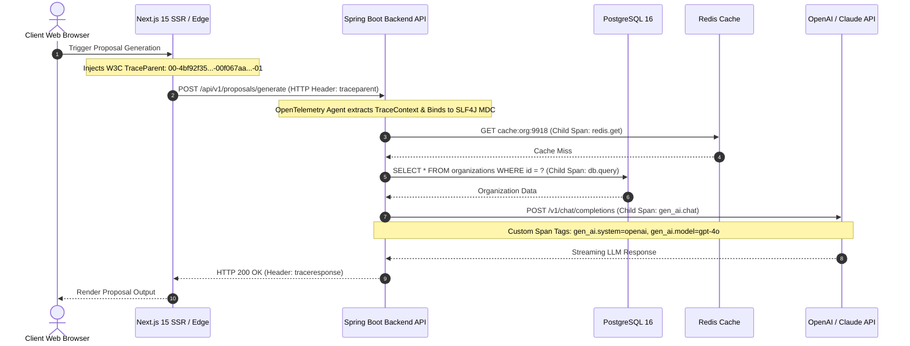

# Distributed Tracing Architecture & OpenTelemetry Propagation Standard
## AI Agency Operating System (AgencyOS)

---

## 1. Purpose

This document details distributed trace propagation, OpenTelemetry span naming conventions, W3C TraceContext standards, and end-to-end execution path instrumentation across AgencyOS.

---

## 2. Distributed Tracing Flow Across Boundaries

---

## 3. Span Naming Conventions

All OpenTelemetry spans generated within AgencyOS must follow standardized operation name patterns:

- **HTTP Requests (Server)**: `HTTP {METHOD} {route_template}` (e.g. `HTTP POST /api/v1/proposals/generate`)
- **HTTP Client (Egress)**: `HTTP {METHOD}` (e.g. `HTTP POST https://api.openai.com`)
- **Database Spans**: `DB {operation} {table_name}` (e.g. `DB SELECT proposals`)
- **Redis Cache Spans**: `REDIS {command} {key_prefix}` (e.g. `REDIS GET cache:org`)
- **AI LLM Spans**: `GEN_AI {provider} {model}` (e.g. `GEN_AI Anthropic claude-3-5-sonnet`)
- **Background Worker Spans**: `JOB {queue_name} {handler}` (e.g. `JOB proposals-queue ProposalRenderHandler`)

---

## 4. Sampling Strategy & Retention

- **Tail-Based Sampling Policy**:
  - 100% of Traces containing `ERROR` span statuses are retained.
  - 100% of Traces with duration > 1,000ms are retained.
  - 10% Probabilistic Sampling applied to standard 2xx HTTP requests under 200ms.
- **Backend Collector Exporter**: Exported via OTLP gRPC to **Grafana Tempo**.
- **Retention Period**: 7 Days in Grafana Tempo; 30 Days archived to AWS S3.
