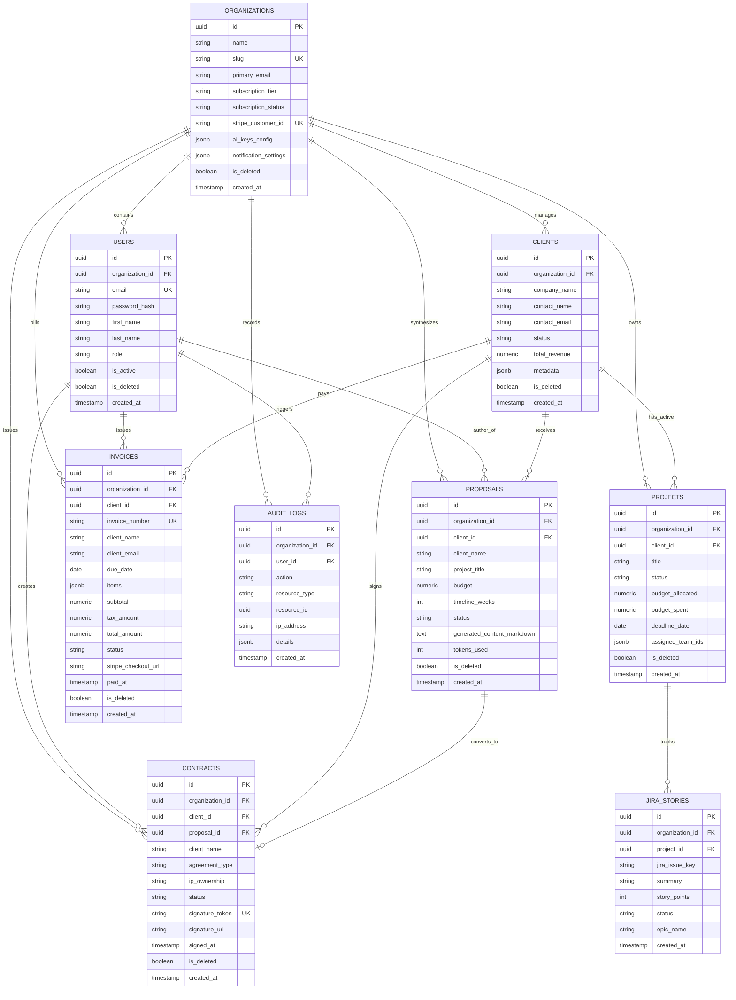

# Entity Relationship Diagram (ERD) Specification
## AI Agency Operating System (AgencyOS)

---

## 1. Complete Mermaid ERD

```mermaid
erDiagram
    ORGANIZATIONS ||--o{ USERS : "contains"
    ORGANIZATIONS ||--o{ CLIENTS : "manages"
    ORGANIZATIONS ||--o{ PROJECTS : "owns"
    ORGANIZATIONS ||--o{ PROPOSALS : "synthesizes"
    ORGANIZATIONS ||--o{ CONTRACTS : "issues"
    ORGANIZATIONS ||--o{ INVOICES : "bills"
    ORGANIZATIONS ||--o{ AUDIT_LOGS : "records"

    USERS ||--o{ PROPOSALS : "author_of"
    USERS ||--o{ CONTRACTS : "creates"
    USERS ||--o{ INVOICES : "issues"
    USERS ||--o{ AUDIT_LOGS : "triggers"

    CLIENTS ||--o{ PROJECTS : "has_active"
    CLIENTS ||--o{ PROPOSALS : "receives"
    CLIENTS ||--o{ CONTRACTS : "signs"
    CLIENTS ||--o{ INVOICES : "pays"

    PROPOSALS ||--o| CONTRACTS : "converts_to"
    PROJECTS ||--o{ JIRA_STORIES : "tracks"

    ORGANIZATIONS {
        uuid id PK
        string name
        string slug UK
        string primary_email
        string subscription_tier
        string subscription_status
        string stripe_customer_id UK
        jsonb ai_keys_config
        jsonb notification_settings
        boolean is_deleted
        timestamp created_at
    }

    USERS {
        uuid id PK
        uuid organization_id FK
        string email UK
        string password_hash
        string first_name
        string last_name
        string role
        boolean is_active
        boolean is_deleted
        timestamp created_at
    }

    CLIENTS {
        uuid id PK
        uuid organization_id FK
        string company_name
        string contact_name
        string contact_email
        string status
        numeric total_revenue
        jsonb metadata
        boolean is_deleted
        timestamp created_at
    }

    PROJECTS {
        uuid id PK
        uuid organization_id FK
        uuid client_id FK
        string title
        string status
        numeric budget_allocated
        numeric budget_spent
        date deadline_date
        jsonb assigned_team_ids
        boolean is_deleted
        timestamp created_at
    }

    PROPOSALS {
        uuid id PK
        uuid organization_id FK
        uuid client_id FK
        string client_name
        string project_title
        numeric budget
        int timeline_weeks
        string status
        text generated_content_markdown
        int tokens_used
        boolean is_deleted
        timestamp created_at
    }

    CONTRACTS {
        uuid id PK
        uuid organization_id FK
        uuid client_id FK
        uuid proposal_id FK
        string client_name
        string agreement_type
        string ip_ownership
        string status
        string signature_token UK
        string signature_url
        timestamp signed_at
        boolean is_deleted
        timestamp created_at
    }

    INVOICES {
        uuid id PK
        uuid organization_id FK
        uuid client_id FK
        string invoice_number UK
        string client_name
        string client_email
        date due_date
        jsonb items
        numeric subtotal
        numeric tax_amount
        numeric total_amount
        string status
        string stripe_checkout_url
        timestamp paid_at
        boolean is_deleted
        timestamp created_at
    }

    JIRA_STORIES {
        uuid id PK
        uuid organization_id FK
        uuid project_id FK
        string jira_issue_key
        string summary
        int story_points
        string status
        string epic_name
        timestamp created_at
    }

    AUDIT_LOGS {
        uuid id PK
        uuid organization_id FK
        uuid user_id FK
        string action
        string resource_type
        uuid resource_id
        string ip_address
        jsonb details
        timestamp created_at
    }
```
