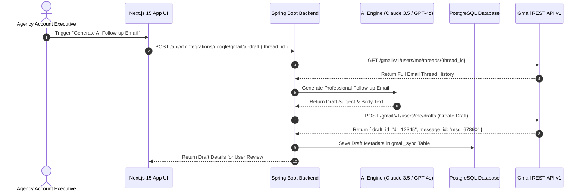

# Enterprise Gmail API Integration Guide
## AI Agency Operating System (AgencyOS)

---

## 1. Purpose

This document details the Gmail REST API v1 integration for reading client emails, automated AI draft generation, email search queries, thread tracking, attachment ingestion, meeting invitations, and follow-up email campaigns.

---

## 2. Architecture & Gmail API Workflow



---

## 3. Supported Gmail Operations & Scopes

### Required Scopes
- `https://www.googleapis.com/auth/gmail.readonly`: Read client email threads & message headers.
- `https://www.googleapis.com/auth/gmail.compose`: Create and manage email drafts.
- `https://www.googleapis.com/auth/gmail.send`: Send client emails & follow-ups on user's behalf.
- `https://www.googleapis.com/auth/gmail.labels`: Apply AgencyOS labels (`AgencyOS/Proposals`, `AgencyOS/Invoices`).

### Key Features Matrix
1. **Thread History Ingestion**: Fetch multi-turn email history to inform AI proposal generators.
2. **AI Follow-up Generator**: Automatically draft context-aware follow-ups for proposals awaiting client signature.
3. **MIME Attachment Extractor**: Extract inbound PDF attachments (SOWs, RFPs) and upload to Google Drive.
4. **Google Cloud Pub/Sub Watch**: Real-time push notifications when new client emails arrive.

---

## 4. Gmail REST API Code Integration (Java SDK)

```java
public Draft createAiEmailDraft(String userId, String threadId, String subject, String bodyText) throws Exception {
    Gmail gmailService = googleApiClientFactory.getGmailService(userId);

    MimeMessage mimeMessage = new MimeMessage((Session) null);
    mimeMessage.setSubject(subject);
    mimeMessage.setText(bodyText);
    mimeMessage.setRecipient(Message.RecipientType.TO, new InternetAddress("client@acme.com"));

    ByteArrayOutputStream bytes = new ByteArrayOutputStream();
    mimeMessage.writeTo(bytes);
    String encodedEmail = Base64.encodeBase64URLSafeString(bytes.toByteArray());

    com.google.api.services.gmail.model.Message message = new com.google.api.services.gmail.model.Message();
    message.setRaw(encodedEmail);
    message.setThreadId(threadId);

    Draft draft = new Draft();
    draft.setMessage(message);

    return gmailService.users().drafts().create("me", draft).execute();
}
```
