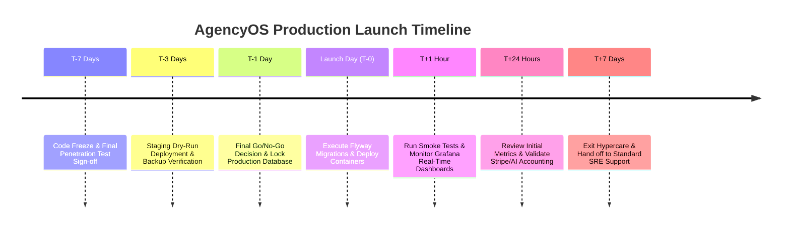

# Production Go-Live Execution Runbook
## AI Agency Operating System (AgencyOS)

---

## 1. Purpose

This document provides a minute-by-minute execution runbook for the production deployment cutover of AgencyOS `v1.0.0-PROD`.

---

## 2. Go-Live Timeline & Execution Sequence

---

## 3. Detailed Minute-by-Minute Launch Execution Plan

### Phase 1: Pre-Launch Readiness (T-7 Days to T-1 Day)
- **T-7 Days**: Enforce strict Code Freeze. Only P0 bug fix PRs permitted. Verify test suite pass rate (100%).
- **T-3 Days**: Execute Staging dry-run deployment. Run point-in-time database restore test.
- **T-1 Day**: Conduct formal Go/No-Go meeting with CTO, VP Eng, QA Lead, SRE Lead, Security Lead. Confirm all 8 sign-offs.

---

### Phase 2: Launch Window Execution (T-0: 02:00 UTC – 04:00 UTC)

| Time (UTC) | Action Item | Executing Owner | Command / Verification |
| :--- | :--- | :--- | :--- |
| `02:00` | Open War Room Google Meet & Slack `#launch-war-room` | Incident Commander | Ping all required leads |
| `02:05` | Enable Maintenance Banner on Web Gateway | Frontend Lead | `NEXT_PUBLIC_MAINTENANCE_MODE=true` |
| `02:10` | Trigger Automated RDS Snapshot Backup | Lead DB Architect | `aws rds create-db-snapshot --db-instance agencyos-prod` |
| `02:15` | Execute Flyway Database Schema Migration | Lead DB Architect | `mvn flyway:migrate -Dflyway.target=7` |
| `02:25` | Deploy Railway & AWS ECS Backend Containers | Release Manager | `railway deploy --tag v1.0.0-PROD` |
| `02:35` | Deploy Vercel Production Frontend Build | Frontend Lead | `vercel --prod` |
| `02:45` | Run Health Check Endpoints Probe | DevOps Engineer | `curl -f https://api.agencyos.ai/actuator/health/readiness` |
| `02:50` | Disable Maintenance Banner & Open Traffic | Frontend Lead | `NEXT_PUBLIC_MAINTENANCE_MODE=false` |
| `03:00` | Execute Automated Production Smoke Tests | QA Architect | `npm run test:smoke:prod` |

---

### Phase 3: Post-Launch Validation (T+1 Hour to T+7 Days)
- **T+1 Hour**: SRE team monitors Grafana Launch Dashboard. Verify HTTP 5xx rate < 0.01%, P95 latency < 150ms.
- **T+24 Hours**: Audit Stripe webhooks, OpenAI/Gemini token accounting, and Jira/Google sync ledgers.
- **T+7 Days**: Conduct Hypercare review standup and formally transition to standard SRE operational support.
