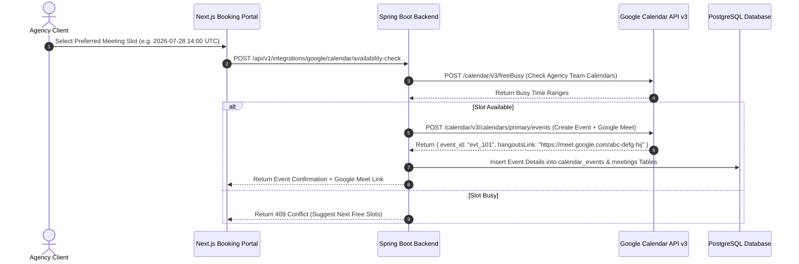

# Enterprise Google Calendar API Integration Guide
## AI Agency Operating System (AgencyOS)

---

## 1. Purpose

This document specifies the Google Calendar API v3 integration for automated client meeting scheduling, real-time availability checks (`freebusy`), recurring event management, timezone conversions, and automated reminders.

---

## 2. Calendar Scheduling & Availability Architecture

---

## 3. Mandatory Scopes & Features

- **Scope**: `https://www.googleapis.com/auth/calendar.events` (Manage calendar events).
- **Scope**: `https://www.googleapis.com/auth/calendar.readonly` (Read calendar free/busy availability).
- **Timezone Normalization**: All event timestamps are stored in UTC (`2026-07-28T14:00:00Z`) and rendered in client browser local timezone.
- **Conference Data Version**: Set `conferenceDataVersion=1` on event creation to automatically attach a **Google Meet** video conference link.
