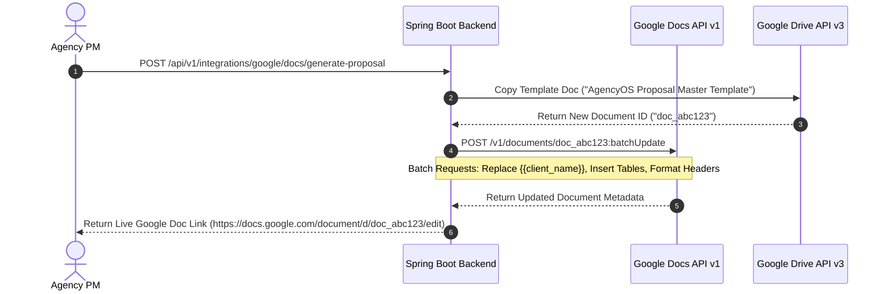

# Enterprise Google Docs API Integration Guide
## AI Agency Operating System (AgencyOS)

---

## 1. Purpose

This document specifies the Google Docs v1 API integration for automated AI proposal document generation, SOW compiling, contract drafting, inline template variable replacements, and collaborative inline comments.

---

## 2. Google Docs Generation & BatchUpdate Architecture



---

## 3. BatchUpdate Requests Specification (`documents.batchUpdate`)

To modify a Google Doc atomically without multiple HTTP network calls, AgencyOS sends a array of `Request` objects:

```json
{
  "requests": [
    {
      "replaceAllText": {
        "containsText": { "text": "{{client_name}}", "matchCase": true },
        "replaceText": "Acme Corporation"
      }
    },
    {
      "replaceAllText": {
        "containsText": { "text": "{{total_budget}}", "matchCase": true },
        "replaceText": "$75,000.00 USD"
      }
    }
  ]
}
```
