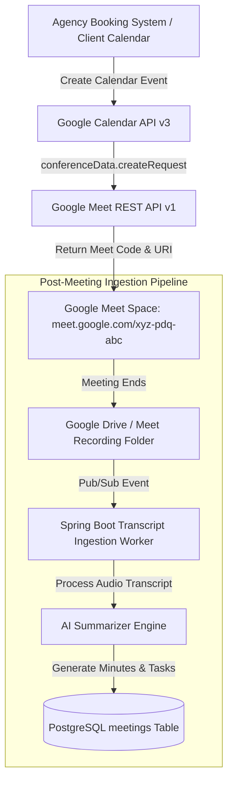

# Enterprise Google Meet Integration Guide
## AI Agency Operating System (AgencyOS)

---

## 1. Purpose

This document specifies the Google Meet REST API integration for dynamic meeting room provisioning, meeting metadata management, Google Calendar sync, and automated transcript/recording metadata ingestion.

---

## 2. Google Meet Integration Architecture

---

## 3. Key Integration Capabilities

1. **Automatic Space Provisioning**: Every client proposal review or kickoff meeting created via AgencyOS automatically includes a secure Google Meet space.
2. **Recording & Transcript Metadata Ingestion**: Automatically link Google Drive Meet recording MP4 files and raw WebVTT transcript files to the corresponding AgencyOS project meeting record.
3. **Meeting Action Item Extraction**: AI Engine processes the meeting transcript into structured action items and syncs them to Google Tasks and Jira Cloud.
