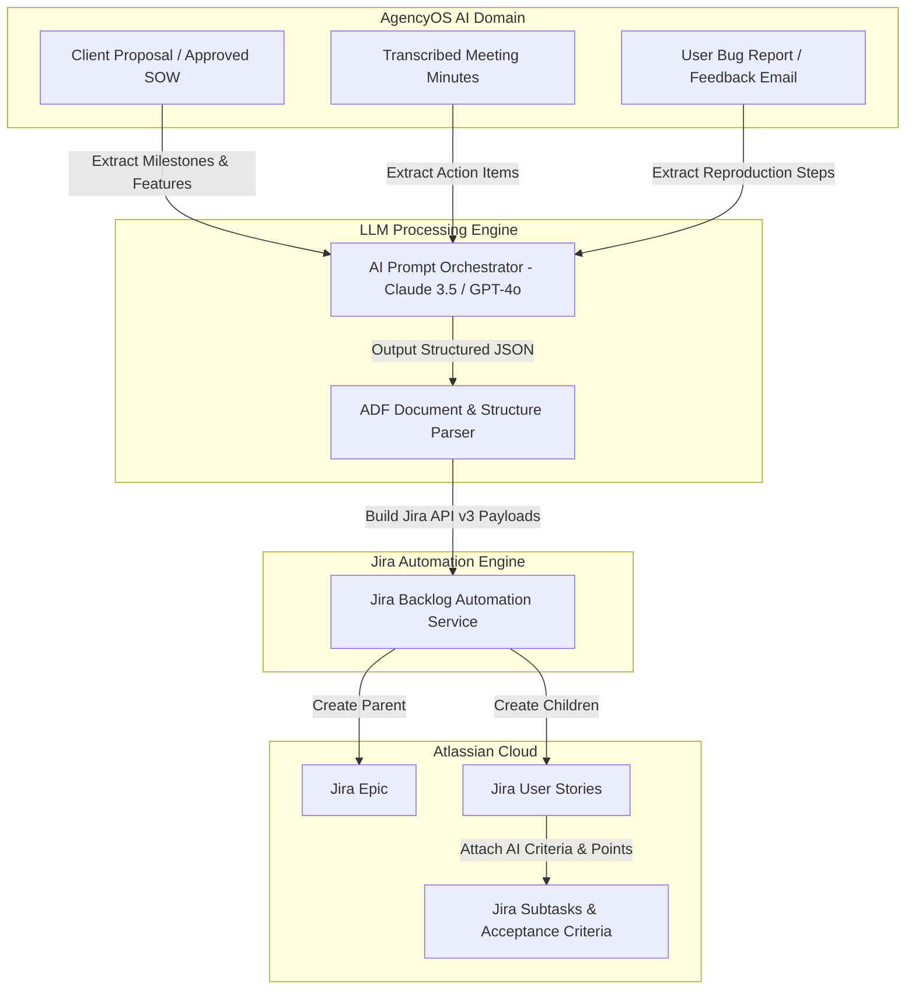

# AI Backlog Automation & Acceptance Criteria Generator Specification
## AI Agency Operating System (AgencyOS)

---

## 1. Purpose

This document details AI-driven Jira backlog automation workflows, automated transformation pipelines (Proposal -> Epic, SOW -> Tasks, Meeting Minutes -> Action Items), AI acceptance criteria generation, story point estimation, and subtask generation.

---

## 2. AI Workflows Architecture



---

## 3. Supported AI Workflows Catalog

### 1. Proposal -> Jira Epic & User Stories
- **Input**: Approved Client Proposal Markdown document.
- **AI Processing**: LLM extracts primary deliverable modules into a parent **Jira Epic** and decomposes each module into 3–7 **User Stories** complete with Acceptance Criteria and estimated Story Points.

### 2. Statement of Work (SOW) -> Technical Tasks
- **Input**: Signed SOW Agreement.
- **AI Processing**: LLM extracts technical milestones, architecture requirements, and dependency links into structured **Jira Tasks** assigned to specific team leads.

### 3. Meeting Minutes -> Jira Action Items
- **Input**: Audio transcript or meeting notes from client sync.
- **AI Processing**: LLM identifies assigned commitments, deadlines, and technical decisions, automatically creating linked **Jira Tasks** with priority assignment.

### 4. Bug Report / Email -> Jira Bug
- **Input**: Inbound client bug email or support ticket.
- **AI Processing**: LLM extracts environment context, expected behavior, actual behavior, and error trace snippets to populate a structured **Jira Bug** report.

---

## 4. AI Acceptance Criteria Generator Prompt & Logic

### Prompt Template (`jira-acceptance-criteria-v1.json`)

```
SYSTEM: You are a Lead Agile Business Analyst and QA Architect.
TASK: Analyze the following feature summary and generate complete Given-When-Then Acceptance Criteria, edge cases, and story point estimates.

INPUT FEATURE SUMMARY:
"{feature_description}"

OUTPUT FORMAT (JSON):
{
  "summary": "Short title",
  "user_story": "As a [role], I want [goal] so that [benefit].",
  "acceptance_criteria": [
    "Given the user is on the login page, When valid credentials are submitted, Then redirect to dashboard.",
    "Given invalid password, When submitted, Then display error 'Invalid credentials'."
  ],
  "edge_cases": [
    "Database connection timeout during authentication",
    "Account locked after 5 failed attempts"
  ],
  "subtasks": [
    "Design API endpoint for login",
    "Implement Spring Security JWT filter",
    "Write unit test for invalid password"
  ],
  "suggested_story_points": 5,
  "suggested_labels": ["auth", "security", "ai-generated"]
}
```
