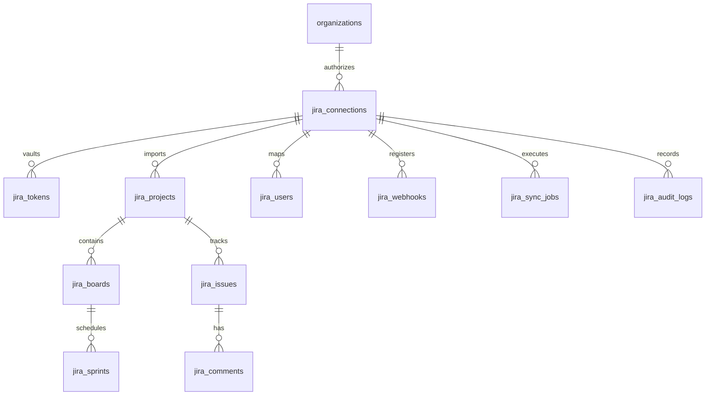

# Enterprise Jira Integration Database Schema
## AI Agency Operating System (AgencyOS)

---

## 1. Purpose

This document defines the relational PostgreSQL database schema (`V5__jira_integration_schema.sql`) for managing multi-tenant Atlassian Cloud OAuth site connections, issue mappings, project boards, sprints, sync job execution logs, and audit records.

---

## 2. Entity Relationship Diagram & Schema Topology



---

## 3. PostgreSQL DDL Schema Definitions

```sql
-- 1. Jira Connections Table (Multi-Tenant Cloud Site Binding)
CREATE TABLE jira_connections (
    id UUID PRIMARY KEY DEFAULT gen_random_uuid(),
    org_id UUID NOT NULL REFERENCES organizations(id) ON DELETE CASCADE,
    cloud_id VARCHAR(255) NOT NULL, -- Atlassian Tenant Cloud ID
    site_url VARCHAR(255) NOT NULL, -- e.g. https://agency.atlassian.net
    site_name VARCHAR(255),
    connected_by_user_id UUID NOT NULL REFERENCES users(id),
    status VARCHAR(50) NOT NULL DEFAULT 'ACTIVE', -- ACTIVE, EXPIRED, DISCONNECTED, ERROR
    created_at TIMESTAMP WITH TIME ZONE DEFAULT CURRENT_TIMESTAMP,
    updated_at TIMESTAMP WITH TIME ZONE DEFAULT CURRENT_TIMESTAMP,
    UNIQUE(org_id, cloud_id)
);

-- 2. Encrypted Tokens Vault (AES-256-GCM)
CREATE TABLE jira_tokens (
    id UUID PRIMARY KEY DEFAULT gen_random_uuid(),
    connection_id UUID NOT NULL UNIQUE REFERENCES jira_connections(id) ON DELETE CASCADE,
    encrypted_access_token TEXT NOT NULL,
    encrypted_refresh_token TEXT NOT NULL,
    token_type VARCHAR(50) DEFAULT 'Bearer',
    scopes TEXT NOT NULL,
    expires_at TIMESTAMP WITH TIME ZONE NOT NULL,
    updated_at TIMESTAMP WITH TIME ZONE DEFAULT CURRENT_TIMESTAMP
);

-- 3. Jira Projects Table
CREATE TABLE jira_projects (
    id UUID PRIMARY KEY DEFAULT gen_random_uuid(),
    connection_id UUID NOT NULL REFERENCES jira_connections(id) ON DELETE CASCADE,
    jira_project_id VARCHAR(100) NOT NULL,
    project_key VARCHAR(50) NOT NULL,
    project_name VARCHAR(255) NOT NULL,
    project_type VARCHAR(50),
    agencyos_project_id UUID REFERENCES projects(id) ON DELETE SET NULL,
    is_sync_enabled BOOLEAN DEFAULT TRUE,
    created_at TIMESTAMP WITH TIME ZONE DEFAULT CURRENT_TIMESTAMP,
    updated_at TIMESTAMP WITH TIME ZONE DEFAULT CURRENT_TIMESTAMP,
    UNIQUE(connection_id, jira_project_id)
);

-- 4. Jira Boards Table
CREATE TABLE jira_boards (
    id UUID PRIMARY KEY DEFAULT gen_random_uuid(),
    project_id UUID NOT NULL REFERENCES jira_projects(id) ON DELETE CASCADE,
    jira_board_id BIGINT NOT NULL,
    name VARCHAR(255) NOT NULL,
    type VARCHAR(50) NOT NULL, -- scrum, kanban
    created_at TIMESTAMP WITH TIME ZONE DEFAULT CURRENT_TIMESTAMP,
    UNIQUE(project_id, jira_board_id)
);

-- 5. Jira Sprints Table
CREATE TABLE jira_sprints (
    id UUID PRIMARY KEY DEFAULT gen_random_uuid(),
    board_id UUID NOT NULL REFERENCES jira_boards(id) ON DELETE CASCADE,
    jira_sprint_id BIGINT NOT NULL,
    name VARCHAR(255) NOT NULL,
    state VARCHAR(50) NOT NULL, -- active, future, closed
    start_date TIMESTAMP WITH TIME ZONE,
    end_date TIMESTAMP WITH TIME ZONE,
    complete_date TIMESTAMP WITH TIME ZONE,
    UNIQUE(board_id, jira_sprint_id)
);

-- 6. Jira Issues Mapping Table
CREATE TABLE jira_issues (
    id UUID PRIMARY KEY DEFAULT gen_random_uuid(),
    project_id UUID NOT NULL REFERENCES jira_projects(id) ON DELETE CASCADE,
    jira_issue_id VARCHAR(100) NOT NULL,
    jira_issue_key VARCHAR(50) NOT NULL,
    issue_type VARCHAR(50) NOT NULL, -- Epic, Story, Task, Subtask, Bug
    summary TEXT NOT NULL,
    status VARCHAR(100) NOT NULL,
    priority VARCHAR(50),
    story_points DECIMAL(5,2),
    assignee_account_id VARCHAR(255),
    parent_issue_key VARCHAR(50),
    agencyos_entity_type VARCHAR(50), -- PROPOSAL, CONTRACT_ACTION, MEETING_MINUTE
    agencyos_entity_id UUID,
    last_synced_at TIMESTAMP WITH TIME ZONE DEFAULT CURRENT_TIMESTAMP,
    created_at TIMESTAMP WITH TIME ZONE DEFAULT CURRENT_TIMESTAMP,
    updated_at TIMESTAMP WITH TIME ZONE DEFAULT CURRENT_TIMESTAMP,
    UNIQUE(project_id, jira_issue_id)
);

-- 7. Jira Comments Mapping Table
CREATE TABLE jira_comments (
    id UUID PRIMARY KEY DEFAULT gen_random_uuid(),
    issue_id UUID NOT NULL REFERENCES jira_issues(id) ON DELETE CASCADE,
    jira_comment_id VARCHAR(100) NOT NULL,
    author_account_id VARCHAR(255) NOT NULL,
    body TEXT NOT NULL,
    created_at TIMESTAMP WITH TIME ZONE DEFAULT CURRENT_TIMESTAMP,
    UNIQUE(issue_id, jira_comment_id)
);

-- 8. Jira User Mappings Table
CREATE TABLE jira_users (
    id UUID PRIMARY KEY DEFAULT gen_random_uuid(),
    connection_id UUID NOT NULL REFERENCES jira_connections(id) ON DELETE CASCADE,
    atlassian_account_id VARCHAR(255) NOT NULL,
    display_name VARCHAR(255) NOT NULL,
    email_address VARCHAR(255),
    agencyos_user_id UUID REFERENCES users(id) ON DELETE SET NULL,
    created_at TIMESTAMP WITH TIME ZONE DEFAULT CURRENT_TIMESTAMP,
    UNIQUE(connection_id, atlassian_account_id)
);

-- 9. Registered Webhooks Table
CREATE TABLE jira_webhooks (
    id UUID PRIMARY KEY DEFAULT gen_random_uuid(),
    connection_id UUID NOT NULL REFERENCES jira_connections(id) ON DELETE CASCADE,
    jira_webhook_id BIGINT NOT NULL UNIQUE,
    webhook_url VARCHAR(500) NOT NULL,
    events TEXT[] NOT NULL,
    secret_key VARCHAR(255) NOT NULL,
    status VARCHAR(50) DEFAULT 'ACTIVE',
    created_at TIMESTAMP WITH TIME ZONE DEFAULT CURRENT_TIMESTAMP
);

-- 10. Sync Jobs Ledger Table
CREATE TABLE jira_sync_jobs (
    id UUID PRIMARY KEY DEFAULT gen_random_uuid(),
    connection_id UUID NOT NULL REFERENCES jira_connections(id) ON DELETE CASCADE,
    job_type VARCHAR(50) NOT NULL, -- FULL, DELTA, AI_BACKLOG
    status VARCHAR(50) NOT NULL, -- IN_PROGRESS, COMPLETED, FAILED
    items_processed INT DEFAULT 0,
    error_summary TEXT,
    started_at TIMESTAMP WITH TIME ZONE DEFAULT CURRENT_TIMESTAMP,
    completed_at TIMESTAMP WITH TIME ZONE
);

-- 11. Jira Audit Logs Table
CREATE TABLE jira_audit_logs (
    id UUID PRIMARY KEY DEFAULT gen_random_uuid(),
    connection_id UUID NOT NULL REFERENCES jira_connections(id) ON DELETE CASCADE,
    actor_id UUID REFERENCES users(id),
    action VARCHAR(100) NOT NULL,
    jira_entity VARCHAR(100) NOT NULL,
    details JSONB,
    created_at TIMESTAMP WITH TIME ZONE DEFAULT CURRENT_TIMESTAMP
);
```

---

## 4. Business Rules & Indexing Strategy

- B-Tree indexes created on `jira_issues(jira_issue_key)`, `jira_issues(agencyos_entity_id)`, `jira_connections(org_id)`, and `jira_tokens(connection_id)`.
- Multi-tenant data access is strictly partitioned by `org_id` via PostgreSQL row-level security policies.
