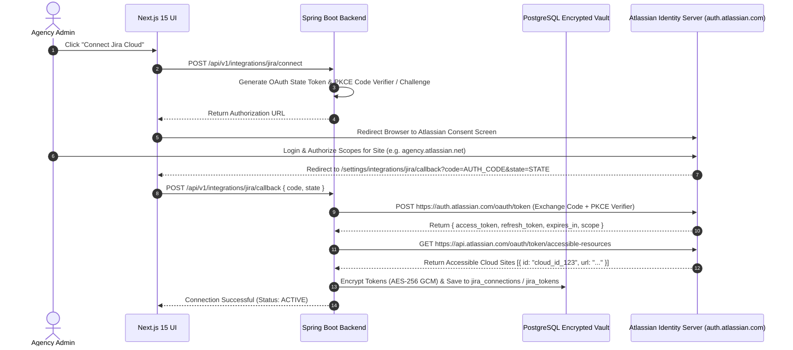

# OAuth 2.0 (3LO) Integration & Token Vault Guide
## AI Agency Operating System (AgencyOS)

---

## 1. Purpose

This document specifies the Atlassian OAuth 2.0 3-Legged Authorization (3LO) flow, PKCE protection, token exchange protocol, refresh token rotation mechanics, scope definitions, consent screen setup, and AES-256-GCM encrypted token storage.

---

## 2. OAuth 2.0 (3LO) Sequence Architecture



---

## 3. Mandatory Atlassian OAuth Scopes

AgencyOS enforces the Principle of Least Privilege by requesting only essential granular scopes:

- `read:jira-work`: Read projects, issues, sprints, boards, comments, and attachments.
- `write:jira-work`: Create and update issues, epics, transitions, and comments.
- `read:jira-user`: Resolve Atlassian Account IDs to user display names and emails.
- `manage:jira-configuration`: Register Atlassian Cloud Webhooks.
- `offline_access`: Obtain rolling Refresh Tokens for background sync execution.

---

## 4. Automatic Refresh Token Rotation Mechanism

Atlassian OAuth 2.0 uses **Rotating Refresh Tokens**. Every time a refresh token is used, a new access token AND a new refresh token are returned. The old refresh token is invalidated immediately.

```java
// Spring Boot Token Refresh Service Code
public synchronized JiraTokenEntity refreshAccessToken(JiraConnectionEntity connection) {
    JiraTokenEntity tokenEntity = connection.getTokens();
    
    if (tokenEntity.getExpiresAt().isAfter(Instant.now().plusSeconds(300))) {
        return tokenEntity; // Still valid for > 5 minutes
    }
    
    String decryptedRefreshToken = aesEncryptionService.decrypt(tokenEntity.getEncryptedRefreshToken());
    
    MultiValueMap<String, String> requestBody = new LinkedMultiValueMap<>();
    requestBody.add("grant_type", "refresh_token");
    requestBody.add("client_id", jiraClientId);
    requestBody.add("client_secret", jiraClientSecret);
    requestBody.add("refresh_token", decryptedRefreshToken);

    OAuthTokenResponse response = restTemplate.postForObject(
        "https://auth.atlassian.com/oauth/token", requestBody, OAuthTokenResponse.class);

    tokenEntity.setEncryptedAccessToken(aesEncryptionService.encrypt(response.getAccessToken()));
    tokenEntity.setEncryptedRefreshToken(aesEncryptionService.encrypt(response.getRefreshToken()));
    tokenEntity.setExpiresAt(Instant.now().plusSeconds(response.getExpiresIn()));
    
    return tokenRepository.save(tokenEntity);
}
```

---

## 5. Security & Vault Storage Rules

1. **AES-256-GCM Encryption**: Tokens are encrypted before write using AES-256-GCM with a unique Initialization Vector (IV) per record. Encryption keys are supplied via AWS KMS or Railway Secret Variables.
2. **Revocation Support**: Disconnecting a site issues a revocation call to `https://auth.atlassian.com/oauth/token/revoke` and purges token records from PostgreSQL.
