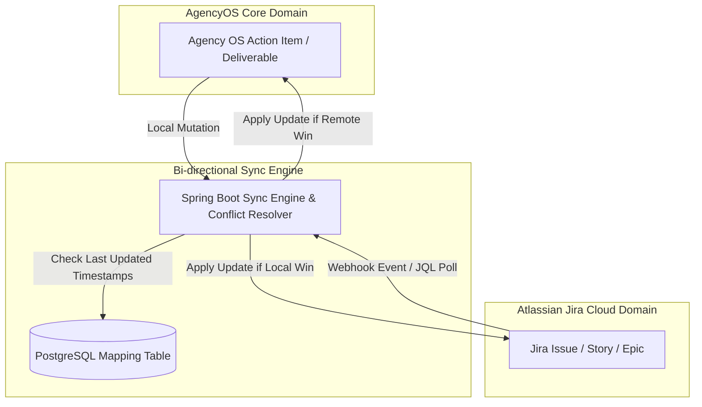

# Enterprise Jira Synchronization Strategy & Engine Specification
## AI Agency Operating System (AgencyOS)

---

## 1. Purpose

This document specifies the bi-directional (two-way) synchronization engine, conflict resolution strategies, delta sync polling algorithms, rate-limit backoff rules, and offline recovery mechanisms for Jira Cloud integration.

---

## 2. Synchronization Architecture & Modes

---

## 3. Sync Execution Modes

| Sync Mode | Trigger Mechanism | Scope | Data Direction | Performance Overhead |
| :--- | :--- | :--- | :--- | :--- |
| **Real-time Webhook Sync** | Atlassian Webhook Events | Single Issue Mutation | Jira -> AgencyOS | Negligible (< 100ms) |
| **Delta Sync (Scheduled)** | Spring `@Scheduled` every 15m | Changed Issues (`updated >= -15m`) | Bi-directional | Low (JQL filtered) |
| **Incremental Sync** | User clicks "Refresh Project" | Specific Project Issues | Bi-directional | Medium |
| **Full Project Sync** | Project Initial Import / Repair | Entire Project Issue History | Bi-directional | Heavy (Paginated REST) |

---

## 4. Conflict Resolution Rules

When an issue is modified simultaneously in both AgencyOS and Jira Cloud:

1. **Rule 1 - Field Ownership Matrix**:
   - `summary` / `description`: Managed by AgencyOS AI Engine (AgencyOS wins).
   - `status` / `workflow`: Managed by Jira Engineering Team (Jira Cloud wins).
   - `story_points` / `assignee`: Shared (Last-Write-Wins based on ISO-8601 timestamp comparison).
2. **Rule 2 - Timestamp Evaluation**: The entity with the later `updated_at` timestamp takes priority.
3. **Rule 3 - Conflict Log Audit**: All overwritten updates generate an entry in `jira_audit_logs` with `details.conflict_resolved = true`.

---

## 5. Rate Limit Handling & Backoff Strategy

Atlassian API Cloud v3 enforces dynamic rate limits. AgencyOS implements automated backoff using `Resilience4j`:

- **Response Header Inspection**: Inspect `X-RateLimit-NearLimit` and HTTP 429 `Retry-After`.
- **Exponential Backoff Formula**:
  $$T_{\text{wait}} = \text{BaseWait} \times 2^{\text{retry\_count}} + \text{jitter}$$
- **Circuit Breaker**: If 5 consecutive 429s occur, pause background sync jobs for 60 seconds.
