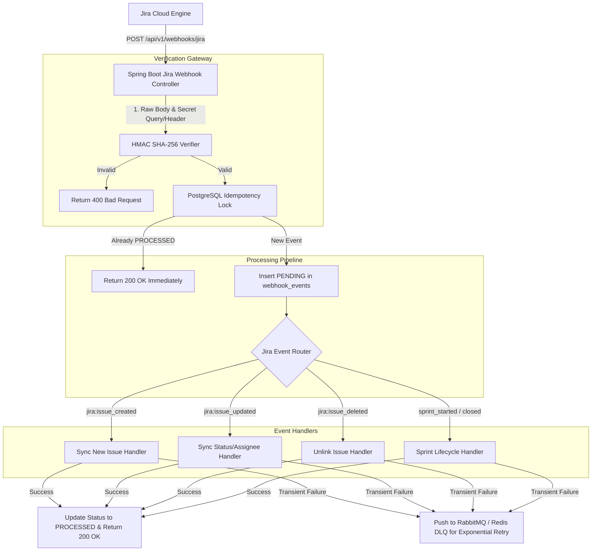

# Jira Cloud Webhooks Architecture & Event Handlers Guide
## AI Agency Operating System (AgencyOS)

---

## 1. Purpose

This document specifies the Atlassian Cloud webhook registration pipeline, HMAC signature verification, idempotency protection, Dead Letter Queue (DLQ) retry mechanics, and event handlers for Jira Cloud webhooks.

---

## 2. Webhook Ingestion Architecture



---

## 3. Webhook Registration API (Jira REST API v3)

Webhooks are programmatically registered with Atlassian Cloud during the initial site connection phase:

```bash
POST https://api.atlassian.com/ex/jira/{cloud_id}/rest/api/3/webhook
Authorization: Bearer ACCESSTOKEN
Content-Type: application/json

{
  "url": "https://api.agencyos.ai/api/v1/webhooks/jira?secret=SEC12345",
  "webhooks": [
    {
      "events": [
        "jira:issue_created",
        "jira:issue_updated",
        "jira:issue_deleted",
        "comment_created",
        "sprint_started",
        "sprint_closed",
        "project_updated"
      ],
      "jqlFilter": "project IS NOT EMPTY"
    }
  ]
}
```

---

## 4. Complete Webhook Event Handlers Catalog (9 Events)

### 1. `jira:issue_created`
- **Action**: Create local mapping in `jira_issues`. If created in Jira, reflect in AgencyOS project dashboard.

### 2. `jira:issue_updated`
- **Action**: Update local status, assignee, priority, and story points. If transition is "Done", mark linked AgencyOS action item complete.

### 3. `jira:issue_deleted`
- **Action**: Mark mapping record in `jira_issues` as unlinked/archived.

### 4. `comment_created`
- **Action**: Ingest comment into `jira_comments` table and cross-post to agency client workspace thread.

### 5. `sprint_started`
- **Action**: Update sprint status in `jira_sprints` to `active`.

### 6. `sprint_closed`
- **Action**: Update sprint status to `closed`. Calculate sprint velocity metrics for agency dashboard.

### 7. `project_updated`
- **Action**: Update project name, key, or avatar details in `jira_projects`.

### 8. `workflow_changed`
- **Action**: Fetch updated workflow transitions for the project and re-index transition IDs.

### 9. `user_added`
- **Action**: Synchronize new user Atlassian Account ID into `jira_users`.

---

## 5. Webhook Idempotency & Replay Mechanics

1. **Event Deduplication**: Webhooks evaluate `webhookEvent` + `timestamp` + `issue.id`.
2. **DLQ Replay**: Failed webhooks enter `jira_sync_jobs` with `status = 'FAILED'`. SREs can trigger replay via `POST /api/v1/admin/jira/webhooks/{event_id}/replay`.
