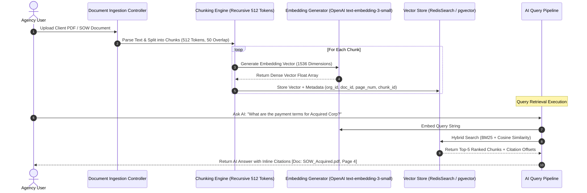

# Vector RAG Knowledge Base & Retrieval Architecture
## AI Agency Operating System (AgencyOS)

---

## 1. Purpose

This document details document ingestion pipelines, chunking strategies, vector store abstractions (RedisSearch / pgvector), hybrid keyword+vector search pipelines, and citation attribution mechanisms.

---

## 2. Ingestion & Retrieval Sequence Architecture



---

## 3. Chunking Strategy & Metadata Schema

- **Strategy**: Recursive Character Text Splitter configured with chunk size of 512 tokens and 50-token overlap.
- **Chunk Metadata Record**:
```json
{
  "chunk_id": "chk_99182371-2391-4a11-82bf-112233445566",
  "document_id": "doc_77112233-4455-6677",
  "org_id": "org_55443322-1100",
  "project_id": "proj_112233",
  "file_name": "Agency_SOW_2026.pdf",
  "page_number": 4,
  "start_char": 1024,
  "end_char": 1536
}
```
