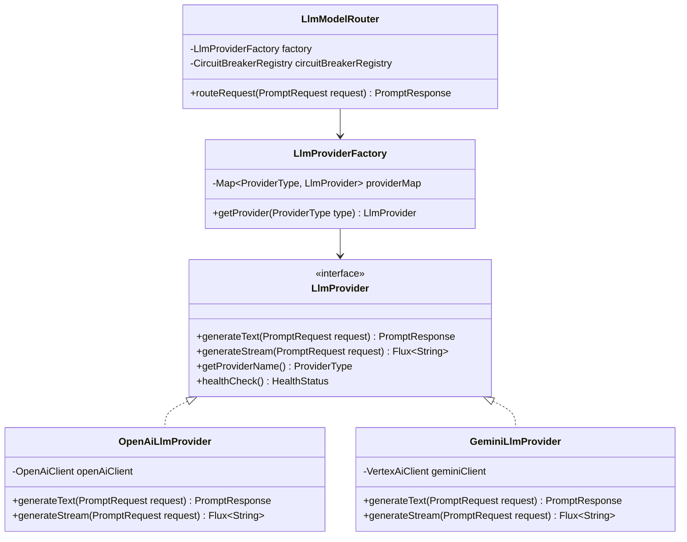

# LLM Provider Architecture & Factory Strategy Pattern Specification
## AI Agency Operating System (AgencyOS)

---

## 1. Purpose

This document specifies the provider interface abstractions, Factory/Strategy design patterns, OpenAI and Google Gemini integration classes, health check probes, and Resilience4j circuit breaker mechanics for LLM operations.

---

## 2. Architecture & Design Pattern Class Model



---

## 3. Business Rules & Circuit Breaker Logic

1. **Circuit Breaker Thresholds (Resilience4j)**:
   - **Failure Rate Threshold**: 50% failures over a rolling window of 20 requests.
   - **Slow Call Threshold**: 50% calls taking > 3,000ms.
   - **Wait Duration in Open State**: 30 Seconds before entering Half-Open state.
2. **Automated Failover Behavior**:
   - If `OpenAiLlmProvider` circuit breaker opens, `LlmModelRouter` automatically delegates subsequent requests to `GeminiLlmProvider`.
   - On fallback, the system appends a header tag `X-AI-Fallback-Triggered: true` to the response telemetry.

---

## 4. Provider Interface Abstraction (Java 21 Specification)

```java
public interface LlmProvider {
    PromptResponse generateText(PromptRequest request);
    Flux<String> generateStream(PromptRequest request);
    ProviderType getProviderName();
    HealthStatus healthCheck();
}

public enum ProviderType {
    OPENAI,
    GEMINI
}
```
