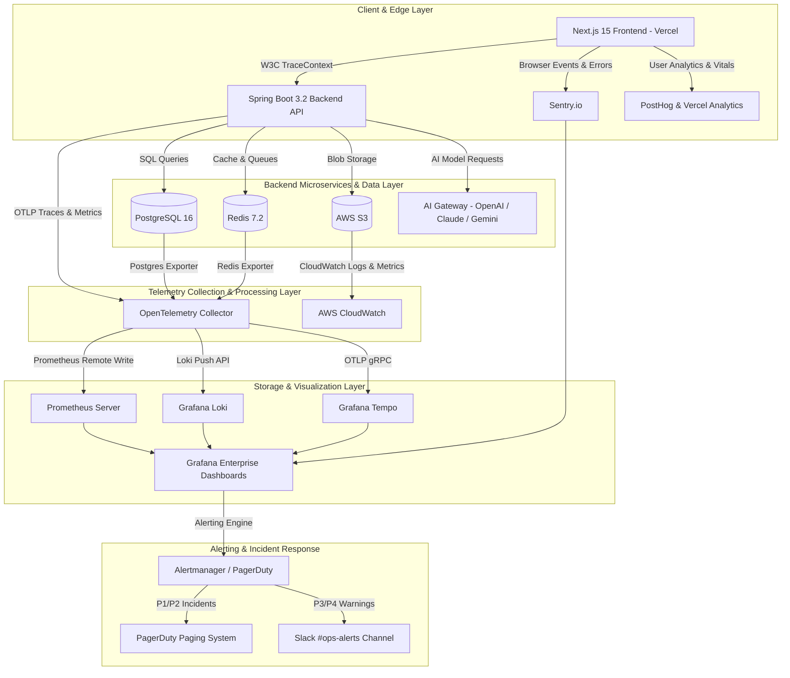

# Master Enterprise Monitoring, Logging & Observability Guide
## AI Agency Operating System (AgencyOS)

---

## Executive Summary & System Overview

The **AI Agency Operating System (AgencyOS)** is an enterprise multi-tenant platform designed to manage digital agency workflows, AI proposal generation, autonomous contract orchestration, client CRM, automated billing, and real-time meeting transcription. 

To ensure 99.99% availability, sub-100ms API response latency, zero data loss, strict multi-tenant security, and transparent AI provider cost governance, AgencyOS implements a unified, end-to-end **Enterprise Observability & Reliability Framework**.

### Platform Architecture & Tech Stack Matrix

| Architecture Component | Technology Stack | Deployment Model | Primary Observability Tools |
| :--- | :--- | :--- | :--- |
| **Frontend Framework** | Next.js 15, React 19, TypeScript | Vercel Edge Network | Vercel Analytics, PostHog, Sentry Browser SDK |
| **Backend API Gateway & Core** | Spring Boot 3.2+ (Java 21) | Railway / AWS ECS Fargate | Micrometer, OTel Java Agent, Prometheus |
| **Relational Database** | PostgreSQL 16 (PgBouncer) | AWS RDS PostgreSQL / Railway | PostgreSQL Exporter, CloudWatch, PgBouncer metrics |
| **Cache & Event Queue** | Redis 7.2 (BullMQ / Spring Data) | AWS ElastiCache / Railway | Redis Exporter, CloudWatch, BullMQ Dashboard |
| **Object Storage** | AWS S3 (KMS Encrypted) | AWS US-East-1 | CloudWatch S3 Metrics, AWS CloudTrail |
| **AI Infrastructure** | OpenAI, Anthropic Claude, Google Gemini | Provider APIs | Custom AI Gateway Metrics, OTel Custom Spans |
| **Telemetry Aggregation** | OpenTelemetry Collector 0.95+ | AWS ECS / Railway Sidecar | OTLP gRPC/HTTP Collector Pipeline |

---

## Enterprise Observability Architecture

The observability model is built upon the **Three Pillars of Observability** (Logs, Metrics, Traces), augmented by unified Event Correlation and tail-based distributed tracing across all system boundaries.



---

## Complete Observability Documentation Suite Index

This master guide is complemented by 13 detailed sub-domain specification documents:

1. [Observability Architecture](file:///Users/vinodkumar/Desktop/playground/Web%20Applications%20Project/AI%20Agency%20Operating%20System/observability_architecture.md) - Pipeline topology, OTel Collector specification, data retention & event correlation.
2. [Logging Strategy](file:///Users/vinodkumar/Desktop/playground/Web%20Applications%20Project/AI%20Agency%20Operating%20System/logging_strategy.md) - Structured JSON schema, log levels, correlation tokens, and 15 log categories.
3. [Monitoring Strategy](file:///Users/vinodkumar/Desktop/playground/Web%20Applications%20Project/AI%20Agency%20Operating%20System/monitoring_strategy.md) - Tooling selection, 10 application domains, and 14 executive business dashboards.
4. [Grafana Dashboards](file:///Users/vinodkumar/Desktop/playground/Web%20Applications%20Project/AI%20Agency%20Operating%20System/grafana_dashboards.md) - 8 production Grafana panel layouts with PromQL/Loki queries.
5. [Prometheus Metrics](file:///Users/vinodkumar/Desktop/playground/Web%20Applications%20Project/AI%20Agency%20Operating%20System/prometheus_metrics.md) - Standard metric dictionary, labels, metric types, scrape targets.
6. [Alerting Strategy](file:///Users/vinodkumar/Desktop/playground/Web%20Applications%20Project/AI%20Agency%20Operating%20System/alerting_strategy.md) - Alert catalog, PromQL rules, severity hierarchy, routing rules.
7. [Incident Response Runbook](file:///Users/vinodkumar/Desktop/playground/Web%20Applications%20Project/AI%20Agency%20Operating%20System/incident_response_runbook.md) - Severity definitions (SEV-0 to SEV-3), escalation matrix, war room protocols, postmortem guidelines.
8. [Distributed Tracing](file:///Users/vinodkumar/Desktop/playground/Web%20Applications%20Project/AI%20Agency%20Operating%20System/distributed_tracing.md) - Context propagation, W3C headers, span naming conventions, end-to-end trace flows.
9. [Security Monitoring](file:///Users/vinodkumar/Desktop/playground/Web%20Applications%20Project/AI%20Agency%20Operating%20System/security_monitoring.md) - Threat detection, RBAC violations, rate limiting, JWT validation failure audit.
10. [Performance Monitoring](file:///Users/vinodkumar/Desktop/playground/Web%20Applications%20Project/AI%20Agency%20Operating%20System/performance_monitoring.md) - Core Web Vitals (LCP, CLS, INP), backend throughput, database & AI latency SLAs.
11. [Health Checks](file:///Users/vinodkumar/Desktop/playground/Web%20Applications%20Project/AI%20Agency%20Operating%20System/health_checks.md) - Liveness and readiness endpoints, external dependency probes, synthetic tests.
12. [Log Retention Policy](file:///Users/vinodkumar/Desktop/playground/Web%20Applications%20Project/AI%20Agency%20Operating%20System/log_retention_policy.md) - Multi-tier environment retention, S3 lifecycle archival, PII redaction rules.
13. [Operational Runbooks](file:///Users/vinodkumar/Desktop/playground/Web%20Applications%20Project/AI%20Agency%20Operating%20System/operational_runbooks.md) - Step-by-step resolution guides for 8 major production outages.

---

## Component Standard Specification Matrix

Each system component in AgencyOS follows a strict 9-point SRE telemetry specification standard:

```
+-----------------------------------------------------------------------------------+
|                            COMPONENT TELEMETRY SPECIFICATION                       |
+-----------------------------------------------------------------------------------+
| 1. Purpose               | Technical role and architectural boundaries            |
| 2. Metrics Collected     | Prometheus gauges, counters, histograms                   |
| 3. Alert Thresholds      | P1-P4 warning and critical triggers                       |
| 4. Dashboard Widgets     | Grafana panel definitions and PromQL queries               |
| 5. Log Fields            | Mandatory JSON fields & MDC key-value pairs               |
| 6. Trace Attributes      | OpenTelemetry span conventions & custom tags              |
| 7. Retention Policy      | Hot, warm, and cold storage lifetimes                     |
| 8. Escalation Rules      | On-call notification paths and SLAs                       |
| 9. Dependencies          | Upstream and downstream operational prerequisites         |
+-----------------------------------------------------------------------------------+
```

---

## Key SRE Targets & SLAs

- **Service Level Objective (SLO) - Availability**: 99.95% overall platform uptime.
- **SLO - API Latency**: 95% of non-AI requests resolved in < 150ms; 99% in < 500ms.
- **SLO - AI Request Latency**: 95% of streamed AI tokens delivered in < 200ms Time-to-First-Token (TTFT).
- **Mean Time to Detect (MTTD)**: < 2 minutes for P1 incidents.
- **Mean Time to Acknowledge (MTTA)**: < 5 minutes for P1 incidents.
- **Mean Time to Resolve (MTTR)**: < 30 minutes for P1 incidents.
