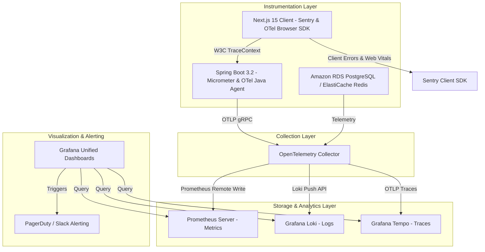

# Master Enterprise Monitoring, Logging & Observability Guide
## AI Agency Operating System (AgencyOS)

---

## 1. Executive Summary & Telemetry Vision

The **AI Agency Operating System (AgencyOS)** employs a unified, end-to-end Observability & SRE Framework designed around the **Three Pillars of Observability**:
1. **Logs**: Structured JSON Line logs ingested into **Grafana Loki** with trace correlation.
2. **Metrics**: Real-time numerical metrics scraped by **Prometheus** and visualized in **Grafana**.
3. **Traces**: Distributed OpenTelemetry spans exported to **Grafana Tempo / AWS X-Ray**.

---

## 2. Production Tooling Stack

- **Metrics Collection**: Prometheus 2.45+ (Scrapes `/actuator/prometheus` every 15s)
- **Log Aggregation**: Grafana Loki 2.9+ / AWS CloudWatch Logs
- **Distributed Tracing**: OpenTelemetry Collector 1.30+ & Grafana Tempo
- **Dashboarding**: Grafana 10.2+ (8 Custom Unified Dashboards)
- **Client APM & Errors**: Sentry.io & PostHog Analytics
- **Alerting Engine**: Grafana Alerting + Prometheus Alertmanager -> PagerDuty & Slack
