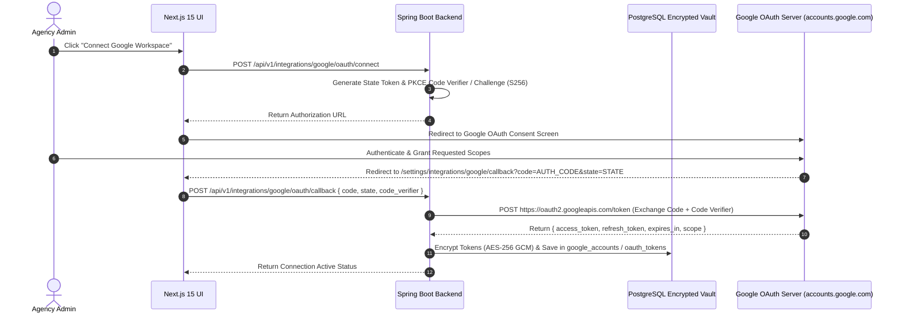

# Google Cloud OAuth 2.0 & Token Vault Architecture Guide
## AI Agency Operating System (AgencyOS)

---

## 1. Purpose

This document specifies Google Cloud Project setup, OAuth 2.0 (3LO with PKCE) flow, consent screen verification, Service Account configuration, token refresh rotation, and AES-256-GCM encrypted token storage.

---

## 2. OAuth 2.0 PKCE Flow Sequence Architecture

---

## 3. Least-Privilege Scope Matrix

| Google Workspace Service | Required OAuth Scope | Access Level Rationale |
| :--- | :--- | :--- |
| **Gmail** | `https://www.googleapis.com/auth/gmail.compose` | Create & manage email drafts |
| **Google Calendar** | `https://www.googleapis.com/auth/calendar.events` | Create & sync meeting events |
| **Google Drive** | `https://www.googleapis.com/auth/drive.file` | Per-file access created by AgencyOS |
| **Google Docs** | `https://www.googleapis.com/auth/documents` | Generate proposal/SOW docs |
| **Google Sheets** | `https://www.googleapis.com/auth/spreadsheets` | Export financial reports |
| **Google Slides** | `https://www.googleapis.com/auth/presentations` | Generate client pitch decks |
| **Google Tasks** | `https://www.googleapis.com/auth/tasks` | Action items synchronization |
