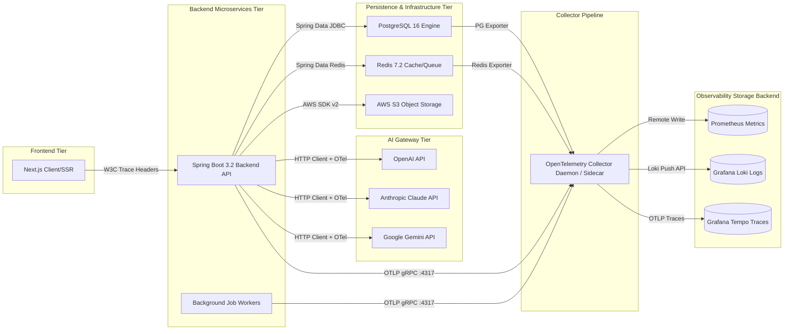

# Enterprise Observability Architecture
## AI Agency Operating System (AgencyOS)

---

## 1. High-Level Observability Architecture

The **AI Agency Operating System (AgencyOS)** employs an OpenTelemetry-native telemetry architecture. All platform tiers—from Next.js edge runtimes to Spring Boot backend services, PostgreSQL database engines, Redis caches, and third-party AI provider gateways—emit standardized metrics, structured JSON logs, and W3C trace context.



---

## 2. The Three Pillars of Observability

### A. Metrics (Quantitative State Measurement)
- **Collection Method**: Pull-based scraping by Prometheus from `/actuator/prometheus` endpoints and exporter targets, supplemented by OpenTelemetry OTLP Push.
- **Resolution**: High-resolution 15-second scrape intervals for production system metrics; 60-second intervals for business indicators.
- **Storage Backend**: Prometheus TSDB with long-term retention via Thanos / VictoriaMetrics.

### B. Structured Logs (Qualitative Context & Event History)
- **Collection Method**: Logback Appender producing single-line JSON (`logstash-logback-encoder`), ingested by Grafana Promtail / OTel Collector.
- **Format**: Standardized OpenTelemetry log format extended with MDC correlation properties (`trace_id`, `span_id`, `org_id`, `user_id`).
- **Storage Backend**: Grafana Loki indexed by labels (`app`, `env`, `level`, `component`).

### C. Distributed Traces (Execution Path & Request Diagnostics)
- **Collection Method**: OpenTelemetry Java Agent auto-instrumentation combined with Manual Span creation for AI Provider calls.
- **Propagation Standard**: W3C TraceContext (`traceparent: 00-4bf92f3577b34da6a3ce929d0e0e4736-00f067aa0ba902b7-01`).
- **Storage Backend**: Grafana Tempo indexed by `trace_id` and service names.

---

## 3. Telemetry Flow & Event Correlation

To ensure total trace-to-log and trace-to-metric correlation, AgencyOS enforces unified metadata propagation:

```
[User Request] 
      │
      ▼
[Next.js Middleware] ─── (Generates X-Request-ID & Initial TraceParent Header)
      │
      ▼
[Spring Boot Spring Security Filter] ─── (Extracts TraceParent, Binds to SLF4J MDC)
      │
      ├──> [Loki Logs] (Contains trace_id, span_id, org_id)
      ├──> [Prometheus Metrics] (Tagged with route, status_code, tenant_tier)
      └──> [Tempo Spans] (Contains SQL queries, Redis keys, AI prompt metadata)
```

### Correlation Keys Standard Matrix
1. `trace_id`: 128-bit hex string identifying the single end-to-end user operation.
2. `span_id`: 64-bit hex string identifying the discrete execution block.
3. `request_id`: UUID generated at the API Gateway boundary (`X-Request-ID`).
4. `org_id`: Tenant UUID for multi-tenant isolation and cost accounting.
5. `user_id`: Authenticated User UUID (`sub` field from JWT).

---

## 4. OpenTelemetry Collector Architecture

The OpenTelemetry Collector operates as an aggregator sidecar on Railway and a daemonset on AWS ECS. It processes telemetry using isolated memory-bounded pipelines.

### Production Collector Configuration (`otel-collector-config.yml`)

```yaml
receivers:
  otlp:
    protocols:
      grpc:
        endpoint: 0.0.0.0:4317
      http:
        endpoint: 0.0.0.0:4318
  prometheus:
    config:
      scrape_configs:
        - job_name: 'spring-boot-actuator'
          scrape_interval: 15s
          metrics_path: '/actuator/prometheus'
          static_configs:
            - targets: ['backend-service:8080']

processors:
  memory_limiter:
    check_interval: 1s
    limit_percentage: 75
    spike_limit_percentage: 20

  batch:
    send_batch_size: 8192
    timeout: 1s
    send_batch_max_size: 10240

  resource:
    attributes:
      - key: environment
        value: "production"
        action: insert
      - key: platform
        value: "AgencyOS"
        action: insert

  tail_sampling:
    decision_wait: 10s
    num_traces: 10000
    expected_new_traces_per_sec: 2000
    policies:
      - name: drop_errors_sample_all
        type: status_code
        status_code: {status_codes: [ERROR]}
      - name: sample_latency_p95
        type: latency
        latency: {threshold_ms: 1000}
      - name: probabilistic_sample
        type: probabilistic
        probabilistic: {sampling_percentage: 10.0}

exporters:
  prometheusremotewrite:
    endpoint: "http://prometheus:9090/api/v1/write"
    resource_to_telemetry_conversion:
      enabled: true

  loki:
    endpoint: "http://loki:3100/loki/api/v1/push"
    default_labels_enabled:
      exporter: false
      job: true

  otlp/tempo:
    endpoint: "tempo:4317"
    tls:
      insecure: true

service:
  pipelines:
    traces:
      receivers: [otlp]
      processors: [memory_limiter, tail_sampling, batch]
      exporters: [otlp/tempo]
    metrics:
      receivers: [otlp, prometheus]
      processors: [memory_limiter, resource, batch]
      exporters: [prometheusremotewrite]
    logs:
      receivers: [otlp]
      processors: [memory_limiter, resource, batch]
      exporters: [loki]
```

---

## 5. Data Retention Strategy

| Telemetry Pillar | Environment | Primary Storage | Retention Period | Archival Destination | Compliance Standard |
| :--- | :--- | :--- | :--- | :--- | :--- |
| **Metrics** | Production | Prometheus TSDB | 30 Days | AWS S3 (Thanos Blocks - 1 Year) | SOC2 Type II |
| **Logs (App/API)** | Production | Grafana Loki | 30 Days Hot | AWS S3 Glacier (3 Years) | GDPR / ISO 27001 |
| **Logs (Audit)** | Production | AWS CloudWatch Logs | 90 Days Hot | AWS S3 Object Lock (7 Years) | SOC2 / HIPAA / PCI |
| **Traces** | Production | Grafana Tempo | 7 Days Hot | AWS S3 (30 Days) | Internal SRE Policy |
| **Metrics/Logs/Traces** | Staging | Loki / Prometheus | 14 Days | N/A (Auto-expended) | Internal QA |
| **Metrics/Logs/Traces** | Dev / QA | Local / Ephemeral | 7 Days | N/A | Developer Sandbox |
