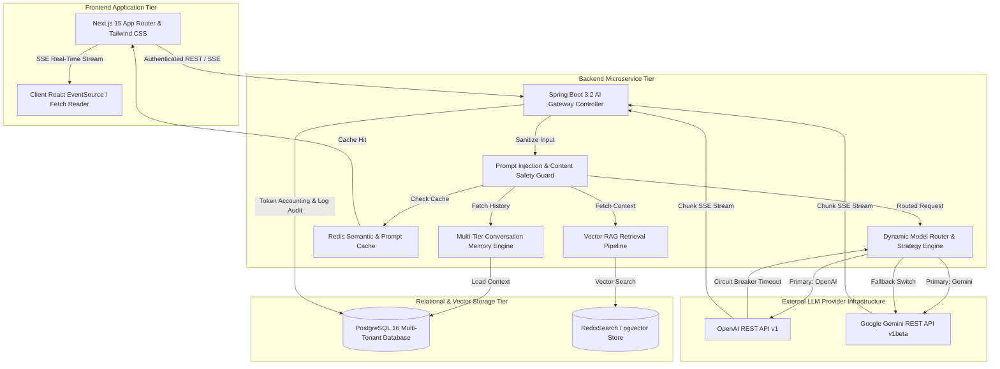

# Master Enterprise OpenAI & Google Gemini AI Integration Guide
## AI Agency Operating System (AgencyOS)

---

## Executive Summary & Solution Architecture

The **AI Agency Operating System (AgencyOS)** features a high-performance, multi-provider AI Gateway integrating **OpenAI (GPT-4o, O3-mini)** and **Google Gemini (Gemini 1.5 Pro, 2.0 Flash)**.

The platform orchestrates autonomous proposal generation, legal contract drafting, real-time meeting transcription summarization, client CRM email automation, Jira backlog decomposition, and interactive AI agent chat using real-time streaming, vector retrieval-augmented generation (RAG), sliding-window conversation memory, and automated multi-provider fallback.



---

## Tech Stack & AI Gateway Infrastructure Matrix

| Architecture Component | Technology Component | Deployment Platform | AI Platform Function |
| :--- | :--- | :--- | :--- |
| **Frontend UI & Streaming** | Next.js 15, React 19, TypeScript | Vercel Edge Network | SSE Stream Render, Token Typing Animation |
| **Backend Core** | Spring Boot 3.2 (Java 21), Maven | Railway / AWS ECS Fargate | AI Gateway, Model Routing, Circuit Breaker |
| **Primary LLM Engine 1** | OpenAI API (`gpt-4o`, `o3-mini`) | OpenAI Enterprise Cloud | Complex Reasoning, Contract Drafting, JSON |
| **Primary LLM Engine 2** | Google Gemini (`gemini-1.5-pro`, `gemini-2.0-flash`) | Google Cloud Vertex / AI Studio | Large Context RAG (1M Tokens), Fast Summarization |
| **Cache & Semantic Search** | Redis 7.2 (RedisSearch / RedisJSON) | AWS ElastiCache / Railway | Prompt Hash Caching, Embedding Vector Cache |
| **Persistence & Accounting**| PostgreSQL 16 (pgvector extension) | AWS RDS PostgreSQL | Conversation History, Token Audit Ledgers |

---

## Comprehensive AI Integration Documentation Index

This master guide is supported by 14 specialized engineering documents:

1. [AI Architecture Guide](file:///Users/vinodkumar/Desktop/playground/Web%20Applications%20Project/AI%20Agency%20Operating%20System/ai_architecture.md) — System topology, AI Gateway routing, streaming pipeline, Redis caching, and RAG architecture.
2. [LLM Provider Architecture](file:///Users/vinodkumar/Desktop/playground/Web%20Applications%20Project/AI%20Agency%20Operating%20System/llm_provider_architecture.md) — Factory and Strategy patterns for OpenAI and Gemini, model routing heuristics, health checks, and circuit breakers.
3. [Prompt Library Guide](file:///Users/vinodkumar/Desktop/playground/Web%20Applications%20Project/AI%20Agency%20Operating%20System/prompt_library.md) — Production prompt templates for Proposal, SOW, Contract, Invoice, Meeting Minutes, Email, Jira, and JSON extraction.
4. [Prompt Versioning Specification](file:///Users/vinodkumar/Desktop/playground/Web%20Applications%20Project/AI%20Agency%20Operating%20System/prompt_versioning.md) — Prompt version control, A/B testing evaluation frameworks, prompt regression tests, and rollback strategies.
5. [Conversation Memory Guide](file:///Users/vinodkumar/Desktop/playground/Web%20Applications%20Project/AI%20Agency%20Operating%20System/conversation_memory.md) — Multi-tier memory architecture (Short-Term, Long-Term, Workspace, Org, Project) and context window sliding algorithms.
6. [Knowledge Base Architecture](file:///Users/vinodkumar/Desktop/playground/Web%20Applications%20Project/AI%20Agency%20Operating%20System/knowledge_base.md) — Document chunking, vector embedding generation, vector store abstraction, search pipeline, and citation attribution.
7. [AI REST API Specification](file:///Users/vinodkumar/Desktop/playground/Web%20Applications%20Project/AI%20Agency%20Operating%20System/ai_api_specification.md) — REST API catalog for `/ai/chat`, `/ai/proposal`, `/ai/sow`, `/ai/contract`, `/ai/meeting`, `/ai/jira`, `/ai/summarize`, `/ai/json`.
8. [Token Usage Tracking Guide](file:///Users/vinodkumar/Desktop/playground/Web%20Applications%20Project/AI%20Agency%20Operating%20System/token_usage_tracking.md) — Multi-model token accounting engine, tenant organization quotas, user consumption ledgers, and billing sync.
9. [Cost Monitoring Architecture](file:///Users/vinodkumar/Desktop/playground/Web%20Applications%20Project/AI%20Agency%20Operating%20System/cost_monitoring.md) — Per-call expenditure tracking, provider cost comparison dashboards, monthly budget limit enforcement, and prompt optimization.
10. [AI Security Guidelines](file:///Users/vinodkumar/Desktop/playground/Web%20Applications%20Project/AI%20Agency%20Operating%20System/security_guidelines.md) — API key management, prompt injection defense, output validation, content filtering, audit logging, and RBAC controls.
11. [Provider Fallback Strategy](file:///Users/vinodkumar/Desktop/playground/Web%20Applications%20Project/AI%20Agency%20Operating%20System/provider_fallback_strategy.md) — Fallback matrix between OpenAI and Google Gemini, circuit breaker thresholds, latency-based auto-switching, and quality protection.
12. [AI Testing Guide](file:///Users/vinodkumar/Desktop/playground/Web%20Applications%20Project/AI%20Agency%20Operating%20System/ai_testing_guide.md) — Test strategy for LLM providers: mock provider test fixtures, integration tests, load tests, latency benchmarks, and JSON validation.
13. [AI Monitoring & Observability](file:///Users/vinodkumar/Desktop/playground/Web%20Applications%20Project/AI%20Agency%20Operating%20System/ai_monitoring.md) — Prometheus indicators, Grafana AI Dashboard layouts, and Alertmanager rules for model outages, high latency, and cost anomalies.
14. [AI Deployment Guide](file:///Users/vinodkumar/Desktop/playground/Web%20Applications%20Project/AI%20Agency%20Operating%20System/deployment_guide.md) — Deployment architecture, environment variables matrix (placeholders only), secrets management, pre-launch checklist, and rollback procedures.

---

## 10-Point Standard Section Structure

Each sub-domain document implements the required enterprise architecture framework:

```
+-----------------------------------------------------------------------------------+
|                        SUB-DOMAIN DOCUMENTATION FRAMEWORK                          |
+-----------------------------------------------------------------------------------+
| 1. Purpose           | Integration objective, operational scope & architectural role|
| 2. Architecture      | Component diagrams, sequence flows & integration topology  |
| 3. Business Rules    | Hard constraints, model routing rules & token quota limits  |
| 4. Data Data Flow    | Ingress/egress payload schemas, prompt engineering & storage|
| 5. Security          | Secrets management, prompt injection defense & RBAC rules  |
| 6. Performance       | Streaming latency, Redis caching & model throughput SLAs   |
| 7. Testing           | Unit tests, mock provider fixtures & JSON validation tests |
| 8. Monitoring        | Prometheus metrics, Grafana panels & Alertmanager thresholds |
| 9. Deployment        | Environment variable keys (placeholders) & CI/CD pipeline |
| 10. Best Practices   | AI SRE guidelines & LLM integration anti-pattern rules     |
+-----------------------------------------------------------------------------------+
```

---

## Key AI Architecture SLAs & Guardrails

- **Time-To-First-Token (TTFT) SLO**: < 200 ms for 95% of streamed SSE responses.
- **Provider Fallback Failover SLA**: Automatic provider switch completed in < 1,500 ms upon primary model HTTP 5xx or timeout.
- **JSON Schema Validation Rate**: 100% strict compliance for structured extraction output endpoints (`/ai/json`, `/ai/jira`).
- **Prompt Injection Neutralization Rate**: 100% defense against system prompt override attacks via strict input delimiter boundaries.
