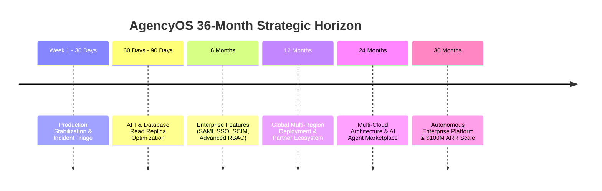

# Master Enterprise Post-Launch Scaling Roadmap
## AI Agency Operating System (AgencyOS)

---

## Executive Summary & Strategic Scaling Vision

The **AI Agency Operating System (AgencyOS)** Post-Launch Scaling Roadmap details the multi-year engineering, infrastructure, AI platform, business, and operational evolution from **Day 1 Production Launch** through **36 Months Enterprise Scale**.

This roadmap establishes Google SRE reliability principles (Capacity Planning, SLIs/SLOs, Error Budgets), progressive multi-region cloud scaling, FinOps cost optimization, autonomous AI agent marketplaces, and enterprise governance (SOC 2, ISO 27001, SAML SSO, SCIM).

---

## Part 1: Executive Summary & Core Engineering Principles

### Strategic Mission & Vision

- **Mission**: Empower digital agencies globally to scale revenue and operational throughput through autonomous AI proposal generation, contract orchestration, and integrated project backlogs.
- **Vision**: Become the default global operating system for AI-first digital agencies, scaling to support 50,000+ active tenant organizations, 1,000,000+ users, and $100M+ ARR by Year 3.

### Core Engineering & SRE Principles

1. **Reliability First**: Maintain 99.95% to 99.99% availability SLAs. Features are gated by strict Error Budget policies.
2. **Horizontal Everything**: All database, cache, API gateway, and worker components must scale horizontally without single points of failure (SPOFs).
3. **Multi-Tenant Isolation**: Enforce zero cross-tenant data leakage via cryptographic token vaulting and row-level database security.
4. **FinOps Cost Discipline**: Maintain gross margin >= 80% through continuous prompt compression, semantic caching, and spot instance execution.
5. **Autonomy Through AI**: Automate internal operational workflows (incident triage, scaling, data backups) using specialized AI agents.

---

## Comprehensive Post-Launch Documentation Suite Index

This master roadmap guide is supported by 14 specialized scaling documents:

1. [Technical Scaling Strategy](file:///Users/vinodkumar/Desktop/playground/Web%20Applications%20Project/AI%20Agency%20Operating%20System/technical_scaling_strategy.md) — Architectural evolution from single-region microservices to multi-region event-driven meshes.
2. [Business Growth Strategy](file:///Users/vinodkumar/Desktop/playground/Web%20Applications%20Project/AI%20Agency%20Operating%20System/business_growth_strategy.md) — Monetization scaling, usage-based billing, enterprise sales, partner referral programs, and MRR trajectories.
3. [Infrastructure Scaling Strategy](file:///Users/vinodkumar/Desktop/playground/Web%20Applications%20Project/AI%20Agency%20Operating%20System/infrastructure_scaling.md) — AWS/Vercel/Railway multi-region expansion, CDN edge caching, and global disaster recovery.
4. [Database Scaling Roadmap](file:///Users/vinodkumar/Desktop/playground/Web%20Applications%20Project/AI%20Agency%20Operating%20System/database_scaling.md) — PostgreSQL read replicas, PgBouncer pooling, partitioning, sharding readiness, and multi-region replication.
5. [AI Scaling Strategy](file:///Users/vinodkumar/Desktop/playground/Web%20Applications%20Project/AI%20Agency%20Operating%20System/ai_scaling_strategy.md) — LLM router scale, RAG vector store expansion, prompt versioning, autonomous agent marketplace, and AI cost controls.
6. [Customer Success Strategy](file:///Users/vinodkumar/Desktop/playground/Web%20Applications%20Project/AI%20Agency%20Operating%20System/customer_success_strategy.md) — Interactive onboarding academies, community portals, NPS tracking, and customer health score algorithms.
7. [Engineering Growth Plan](file:///Users/vinodkumar/Desktop/playground/Web%20Applications%20Project/AI%20Agency%20Operating%20System/engineering_growth_plan.md) — Team expansion (Backend, Frontend, AI, Platform, SRE, Security, QA), career tracks, and DevEx optimization.
8. [Security Maturity Roadmap](file:///Users/vinodkumar/Desktop/playground/Web%20Applications%20Project/AI%20Agency%20Operating%20System/security_maturity_roadmap.md) — SOC 2 Type II, ISO 27001, GDPR/CCPA compliance, Zero Trust network model, and automated threat detection.
9. [DevOps Maturity Roadmap](file:///Users/vinodkumar/Desktop/playground/Web%20Applications%20Project/AI%20Agency%20Operating%20System/devops_maturity_roadmap.md) — Terraform IaC, GitOps deployment, Canary releases, Blue-Green deployments, and LaunchDarkly feature flags.
10. [Capacity Planning Framework](file:///Users/vinodkumar/Desktop/playground/Web%20Applications%20Project/AI%20Agency%20Operating%20System/capacity_planning.md) — SRE capacity forecasting, traffic headroom models (3x peak load), CPU/RAM/IOPS buffers, and storage growth projections.
11. [SLO & Reliability Strategy](file:///Users/vinodkumar/Desktop/playground/Web%20Applications%20Project/AI%20Agency%20Operating%20System/slo_strategy.md) — Service Level Objectives (SLOs), SLIs, Error Budgets, availability targets, and MTTR reduction.
12. [Risk Management Register](file:///Users/vinodkumar/Desktop/playground/Web%20Applications%20Project/AI%20Agency%20Operating%20System/risk_management.md) — Technical, operational, AI hallucination, vendor dependency, compliance, and financial risk mitigation registers.
13. [Financial Growth Roadmap](file:///Users/vinodkumar/Desktop/playground/Web%20Applications%20Project/AI%20Agency%20Operating%20System/financial_growth_roadmap.md) — Cloud cost FinOps optimization, unit economics, CAC/LTV benchmarks, and ARR financial projections.
14. [Operational Excellence Framework](file:///Users/vinodkumar/Desktop/playground/Web%20Applications%20Project/AI%20Agency%20Operating%20System/operational_excellence.md) — SRE blameless postmortems, quarterly architecture reviews, operational risk reviews, and automation maturity models.

---

## Part 2: Strategic Growth Timeline Matrix (W1 to 36M)



---

## 11-Point Standard Item Framework

Every roadmap initiative across all sub-domain documents is evaluated against the following SRE framework:

```
+-----------------------------------------------------------------------------------+
|                        SCALING ROADMAP INITIATIVE FRAMEWORK                       |
+-----------------------------------------------------------------------------------+
| 1. Purpose           | Business & architectural objective                         |
| 2. Priority          | P0 (Immediate), P1 (High), P2 (Medium), P3 (Long-term)    |
| 3. Owner             | Responsible Engineering Director / Lead Architect         |
| 4. Timeline          | Targeted completion phase (e.g. 90 Days, 12 Months)       |
| 5. Dependencies      | Prerequisites & architectural blockers                     |
| 6. Implementation    | Multi-phase execution breakdown (Phase 1 to 3)            |
| 7. Success Metrics   | Quantitative outcome metrics (e.g. Latency < 50ms)        |
| 8. KPIs              | Key Performance Indicators linked to business goals       |
| 9. Risks             | Technical or operational scaling failure modes            |
| 10. Mitigation       | Contingency strategy & failback plan                      |
| 11. Review Frequency | Audit cadence (Weekly, Monthly, Quarterly)                |
+-----------------------------------------------------------------------------------+
```
