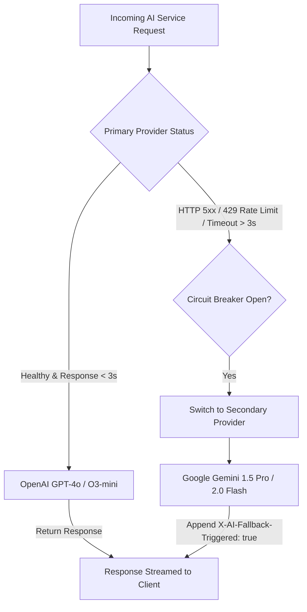

# LLM Provider Fallback Strategy & Failover Mechanics
## AI Agency Operating System (AgencyOS)

---

## 1. Purpose

This document specifies multi-provider failover matrices, circuit breaker thresholds, latency-based auto-switching, and response quality protection between OpenAI and Google Gemini.

---

## 2. Multi-Provider Failover Matrix



---

## 3. Provider Failover Matrix Table

| Service Domain | Primary Model Engine | Secondary Fallback Engine | Failover Trigger Condition | Quality Mitigation Action |
| :--- | :--- | :--- | :--- | :--- |
| **Proposal Generator** | OpenAI `gpt-4o` | Google Gemini `gemini-1.5-pro` | HTTP 5xx / 429 / Timeout > 3.0s | Adjust system prompt for Gemini formatting |
| **Contract Generator** | OpenAI `o3-mini` | OpenAI `gpt-4o` | Reasoning Timeout > 5.0s | Fall back to standard GPT-4o reasoning |
| **Meeting Summarizer** | Google Gemini `gemini-1.5-pro` | OpenAI `gpt-4o` | Gemini API Timeout > 4.0s | Truncate transcript to fit 128k GPT-4o window |
| **JSON Extraction** | OpenAI `gpt-4o` (Structured) | Google Gemini `gemini-1.5-pro` | Schema Validation Failure | Parse output with Jackson + Regex Repair |

---

## 4. Resilience4j Configuration (`application.yml`)

```yaml
resilience4j:
  circuitbreaker:
    instances:
      openaiProvider:
        slidingWindowSize: 20
        failureRateThreshold: 50
        slowCallRateThreshold: 50
        slowCallDurationThreshold: 3000ms
        waitDurationInOpenState: 30000ms
      geminiProvider:
        slidingWindowSize: 20
        failureRateThreshold: 50
        slowCallRateThreshold: 50
        slowCallDurationThreshold: 3000ms
        waitDurationInOpenState: 30000ms
```
