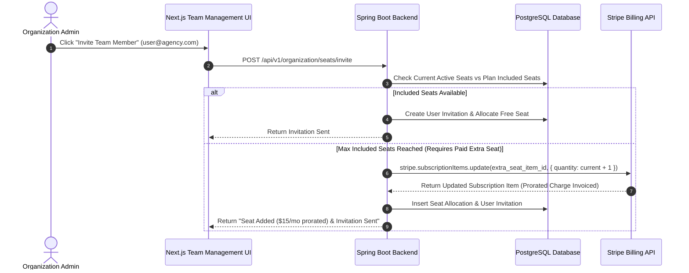

# Seat-Based Licensing & Team Billing Architecture
## AI Agency Operating System (AgencyOS)

---

## 1. Purpose

This document outlines seat licensing mechanics, team member invitation rules, maximum seat caps per plan tier, Stripe subscription item quantity adjustments, and proration calculations.

---

## 2. Seat Allocation Workflow



---

## 3. Business Rules & Proration Math

1. **Included Seats**: Free (1), Starter (2), Professional (5), Business (10).
2. **Additional Seats**: Charged at extra seat recurring price ($15-$20/seat/mo).
3. **Proration Formula**: 
   $$\text{Prorated Charge} = \text{Unit Price} \times \left( \frac{\text{Days Remaining in Cycle}}{\text{Total Days in Cycle}} \right)$$
4. **Seat Removal Policy**: Removing a team member revokes workspace access immediately. The Stripe subscription item quantity decreases by 1 at the next renewal cycle (`proration_behavior = "none"`).

---

## 4. Backend Seat Update Service Code

```java
public void addSeatToSubscription(UUID orgId) throws StripeException {
    SubscriptionEntity sub = subscriptionRepository.findByOrgId(orgId)
            .orElseThrow();
    SubscriptionItemEntity extraSeatItem = sub.getItemByType("extra_seat");

    int newQuantity = extraSeatItem.getQuantity() + 1;

    com.stripe.param.SubscriptionItemUpdateParams params =
            com.stripe.param.SubscriptionItemUpdateParams.builder()
                    .setQuantity((long) newQuantity)
                    .setProrationBehavior(com.stripe.param.SubscriptionItemUpdateParams.ProrationBehavior.ALWAYS_INVOICE)
                    .build();

    com.stripe.model.SubscriptionItem item = 
            com.stripe.model.SubscriptionItem.retrieve(extraSeatItem.getStripeItemId());
    item.update(params);

    extraSeatItem.setQuantity(newQuantity);
    subscriptionItemRepository.save(extraSeatItem);
}
```
