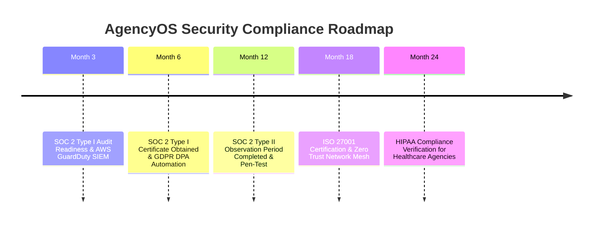

# Enterprise Security Maturity & Compliance Certification Roadmap
## AI Agency Operating System (AgencyOS)

---

## 1. Purpose

This document outlines the security maturity evolution: SOC 2 Type I/II certifications, ISO 27001 framework alignment, GDPR/CCPA privacy enforcement, Zero Trust architecture, key rotation, and annual penetration testing.

---

## 2. Compliance & Security Certification Timeline

---

## 3. Key Security Controls & Standards

1. **Zero Trust Architecture**: All service-to-service communication authenticated via mTLS (Istio Mesh).
2. **Automated Key Rotation**: KMS data encryption keys rotated automatically every 90 days.
3. **Third-Party Penetration Testing**: External white-box penetration testing conducted annually by CREST-certified auditors.
