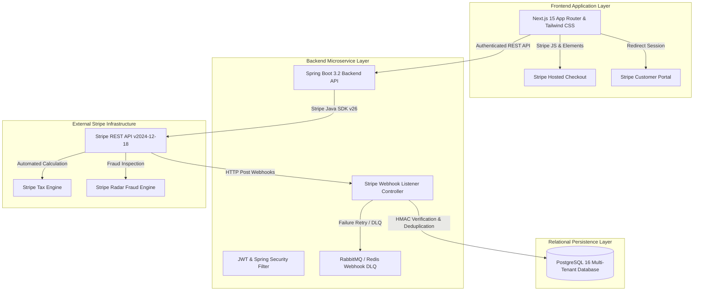

# Master Enterprise Stripe Billing Implementation Guide
## AI Agency Operating System (AgencyOS)

---

## Executive Summary & Solution Architecture

The **AI Agency Operating System (AgencyOS)** implements an enterprise-grade multi-tenant SaaS billing framework powered by **Stripe Billing**, **Stripe Checkout**, and **Stripe Customer Portal**. 

The platform supports hybrid billing models combining **Tiered SaaS Subscriptions** (Free, Starter, Professional, Business, Enterprise), **Seat-Based Member Licensing**, and **Usage-Based AI Credit Metering**.



---

## Tech Stack & Billing Infrastructure Matrix

| Architecture Tier | Technology Component | Deployment Platform | Billing System Function |
| :--- | :--- | :--- | :--- |
| **Frontend UI** | Next.js 15, React 19, TypeScript, Tailwind CSS | Vercel Edge Network | Pricing Tables, Checkout Trigger, Portal Redirect |
| **Backend Core** | Spring Boot 3.2 (Java 21), Maven | Railway / AWS ECS Fargate | Subscription State Machine, Metering Engine |
| **SDK Integration** | Stripe Java SDK (`com.stripe:stripe-java:26.x`) | Embedded Backend Library | Stripe API Client & Object Deserialization |
| **Database** | PostgreSQL 16 (Flyway Migrations) | AWS RDS / Railway PostgreSQL | Local Customer Sync, Quota Ledger, Subscriptions |
| **Webhooks** | Idempotent HTTP Endpoint (`/api/v1/webhooks/stripe`) | Spring Boot Web Component | Webhook Processing & Ledger Mutation |
| **Security** | Spring Security 6, JWT, HMAC SHA256 Verification | Backend API | Webhook Signature Check & RBAC Access Guard |

---

## Comprehensive Stripe Billing Documentation Index

This master guide is supported by 14 specialized engineering documents:

1. [Billing Architecture](file:///Users/vinodkumar/Desktop/playground/Web%20Applications%20Project/AI%20Agency%20Operating%20System/billing_architecture.md) - System topology, end-to-end checkout, renewal, upgrade, downgrade, and cancellation flows.
2. [Subscription Lifecycle](file:///Users/vinodkumar/Desktop/playground/Web%20Applications%20Project/AI%20Agency%20Operating%20System/subscription_lifecycle.md) - State machine transitions (`trialing`, `active`, `past_due`, `canceled`, `unpaid`, `paused`, `expired`), dunning schedules, and grace periods.
3. [Billing Database Schema](file:///Users/vinodkumar/Desktop/playground/Web%20Applications%20Project/AI%20Agency%20Operating%20System/billing_database_schema.md) - PostgreSQL DDL for 13 relational tables including `customers`, `subscriptions`, `usage_records`, `webhook_events`.
4. [Billing API Specification](file:///Users/vinodkumar/Desktop/playground/Web%20Applications%20Project/AI%20Agency%20Operating%20System/billing_api_specification.md) - REST API catalog for Checkout, Subscriptions, Portal Sessions, Seat Management, Usage Summary, and Invoices.
5. [Stripe Webhooks Guide](file:///Users/vinodkumar/Desktop/playground/Web%20Applications%20Project/AI%20Agency%20Operating%20System/stripe_webhooks.md) - Idempotency engine, signature verification, DLQ retry strategy, and 15 event handlers.
6. [Billing Testing Guide](file:///Users/vinodkumar/Desktop/playground/Web%20Applications%20Project/AI%20Agency%20Operating%20System/billing_testing_guide.md) - Test suite using Stripe Sandbox, Stripe CLI triggers, unit/integration tests, and proration math verification.
7. [Customer Portal Guide](file:///Users/vinodkumar/Desktop/playground/Web%20Applications%20Project/AI%20Agency%20Operating%20System/customer_portal.md) - Self-service subscription management, payment method updates, invoice downloads, and portal session generation.
8. [Subscription Plans Specification](file:///Users/vinodkumar/Desktop/playground/Web%20Applications%20Project/AI%20Agency%20Operating%20System/subscription_plans.md) - Feature matrices, seats, AI credits, storage, API call limits, and Price IDs across Free, Starter, Pro, Business, and Enterprise plans.
9. [Usage-Based Billing Guide](file:///Users/vinodkumar/Desktop/playground/Web%20Applications%20Project/AI%20Agency%20Operating%20System/usage_based_billing.md) - AI credit depletion ledger, LLM token tracking, storage overages, and Stripe Usage Records API synchronization.
10. [Seat-Based Billing Guide](file:///Users/vinodkumar/Desktop/playground/Web%20Applications%20Project/AI%20Agency%20Operating%20System/seat_based_billing.md) - Seat allocation lifecycle, team invitation limits, subscription item quantity adjustments, and proration rules.
11. [Billing Security Architecture](file:///Users/vinodkumar/Desktop/playground/Web%20Applications%20Project/AI%20Agency%20Operating%20System/billing_security.md) - PCI DSS SAQ A compliance, webhook signature checks, KMS secrets, RBAC billing controls, and audit trails.
12. [Billing Monitoring & Analytics](file:///Users/vinodkumar/Desktop/playground/Web%20Applications%20Project/AI%20Agency%20Operating%20System/billing_monitoring.md) - Financial metrics (MRR, ARR, Churn, Net Revenue Retention), Grafana Billing Dashboard, and Alertmanager rules.
13. [Billing Deployment Strategy](file:///Users/vinodkumar/Desktop/playground/Web%20Applications%20Project/AI%20Agency%20Operating%20System/billing_deployment.md) - Environment configurations, API key rotation, Vercel/Railway CI/CD setup, go-live checklist, and rollback procedures.
14. [Billing Operational Runbook](file:///Users/vinodkumar/Desktop/playground/Web%20Applications%20Project/AI%20Agency%20Operating%20System/billing_runbook.md) - Triage runbooks for webhook failures, manual refunds, failed payment dunning, invoice credit notes, and tax reconciliation.

---

## 10-Point Standard Section Structure

Each sub-domain document implements the required enterprise architecture framework:

```
+-----------------------------------------------------------------------------------+
|                        SUB-DOMAIN DOCUMENTATION FRAMEWORK                          |
+-----------------------------------------------------------------------------------+
| 1. Purpose           | Business objective, operational scope & architectural role |
| 2. Architecture      | Component diagrams, sequence flows & integration topology  |
| 3. Business Rules    | Hard constraints, quotas, tier limits & proration rules  |
| 4. Data Flow         | Ingress payload schemas, processing pipeline & DB storage |
| 5. Error Handling    | Exception taxonomies, HTTP status mappings & fallback logic|
| 6. Security          | Authentication, authorization, signature checks & PCI rules|
| 7. Testing           | Test scripts, mock fixtures, Stripe CLI validation rules |
| 8. Monitoring        | Prometheus metrics, Grafana panels & Alertmanager thresholds |
| 9. Deployment        | Environment variable keys, feature flags & pipeline steps|
| 10. Best Practices   | SRE & SAA architectural guidelines & anti-pattern rules    |
+-----------------------------------------------------------------------------------+
```

---

## Core Financial SLAs & Key SRE Targets

- **Billing Availability SLO**: 99.99% uptime for subscription verification & checkout endpoints.
- **Webhook Processing Latency**: 95% of incoming Stripe webhooks processed and acknowledged in < 250ms.
- **Webhook Idempotency SLA**: 100% protection against duplicate webhook processing.
- **PCI Compliance Level**: PCI DSS SAQ A (Zero raw credit card data stored or touched by AgencyOS servers).
- **Payment Retry Dunning Recovery Rate Target**: > 45% recovery of failed recurring subscription renewals via Smart Retries.
