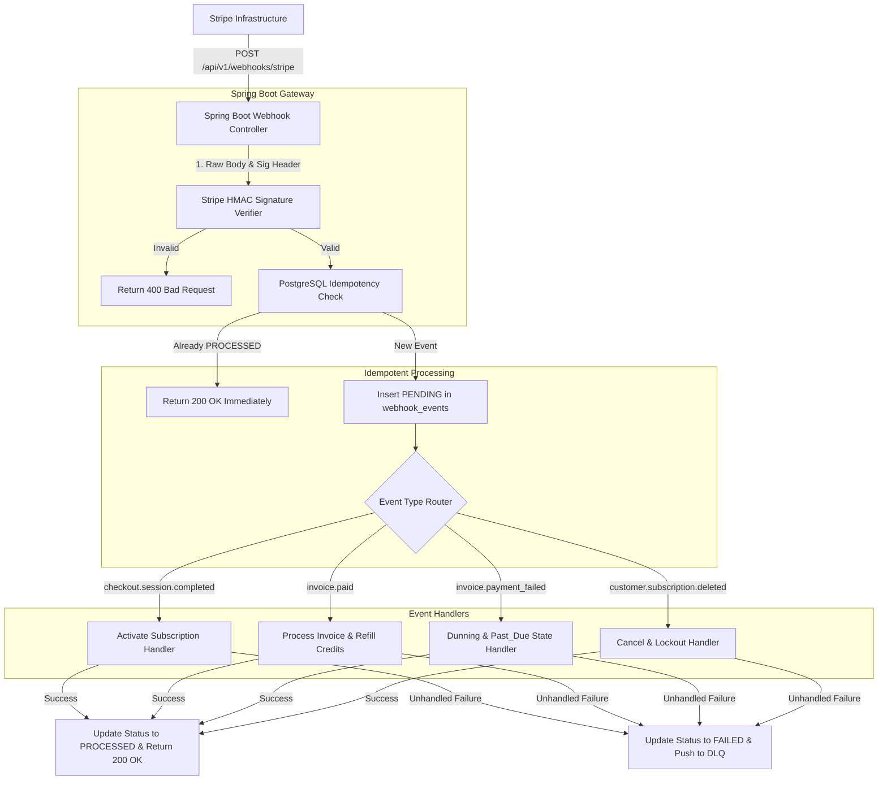

# Stripe Webhooks Architecture & Event Handlers Guide
## AI Agency Operating System (AgencyOS)

---

## 1. Purpose

This document specifies the architecture, signature verification, idempotency handling, Dead Letter Queue (DLQ) retry mechanics, and event processing routines for Stripe webhooks in AgencyOS.

---

## 2. Architecture & Webhook Processing Pipeline



---

## 3. Webhook Idempotency & Replay Strategy

1. **Idempotency Key**: Uses `event.getId()` (e.g. `evt_1Qx...`).
2. **Database Transaction**: Before processing, the application inserts a record into `webhook_events` with `status = 'PENDING'` under a database row lock.
3. **If duplicate `stripe_event_id` is detected**: The request immediately returns HTTP 200 OK without re-executing logic.
4. **Replay Mechanism**: SREs can manually replay failed events from the admin dashboard by executing `POST /api/v1/admin/webhooks/{event_id}/replay`.

---

## 4. Complete Webhook Event Handlers Catalog (15 Events)

### 1. `checkout.session.completed`
- **Action**: Provision customer subscription locally, map `stripe_customer_id` to `org_id`, allocate base plan seats, grant initial AI credits.

### 2. `customer.created`
- **Action**: Create or update local `customers` record with Stripe customer ID and metadata.

### 3. `customer.subscription.created`
- **Action**: Insert initial record in `subscriptions` table.

### 4. `customer.subscription.updated`
- **Action**: Update `status`, `current_period_end`, `cancel_at_period_end`, and seat quantities in local `subscriptions` table.

### 5. `customer.subscription.deleted`
- **Action**: Set status to `canceled`. Degrade tenant access to Free plan. Notify org admins via email.

### 6. `invoice.created`
- **Action**: Store draft invoice details in `invoices` table.

### 7. `invoice.finalized`
- **Action**: Update invoice status to `open`. Store invoice PDF link.

### 8. `invoice.paid`
- **Action**: Mark invoice status `paid`. Reset monthly usage counters. Refill AI token credit balance.

### 9. `invoice.payment_failed`
- **Action**: Update subscription status to `past_due`. Trigger automated dunning notification email.

### 10. `invoice.payment_action_required`
- **Action**: Notify user to complete 3D Secure / SCA authentication via Customer Portal.

### 11. `invoice.upcoming`
- **Action**: Send advance renewal notification email 3 days prior to renewal.

### 12. `payment_intent.succeeded`
- **Action**: Log transaction in `payments` ledger.

### 13. `payment_intent.payment_failed`
- **Action**: Log failed transaction with error message in `payments` ledger.

### 14. `charge.refunded`
- **Action**: Insert record in `refunds` ledger. Adjust credit tokens if necessary.

### 15. `customer.updated`
- **Action**: Synchronize email, name, and payment method details in local `customers` table.

---

## 5. Security & HMAC Signature Verification

```java
// Spring Boot HMAC Verification Code Example
String payload = request.getBody();
String sigHeader = request.getHeader("Stripe-Signature");

try {
    Event event = Webhook.constructEvent(payload, sigHeader, stripeWebhookSecret);
    // Proceed with processing
} catch (SignatureVerificationException e) {
    logger.error("Invalid Stripe Signature", e);
    return ResponseEntity.status(HttpStatus.BAD_REQUEST).build();
}
```
