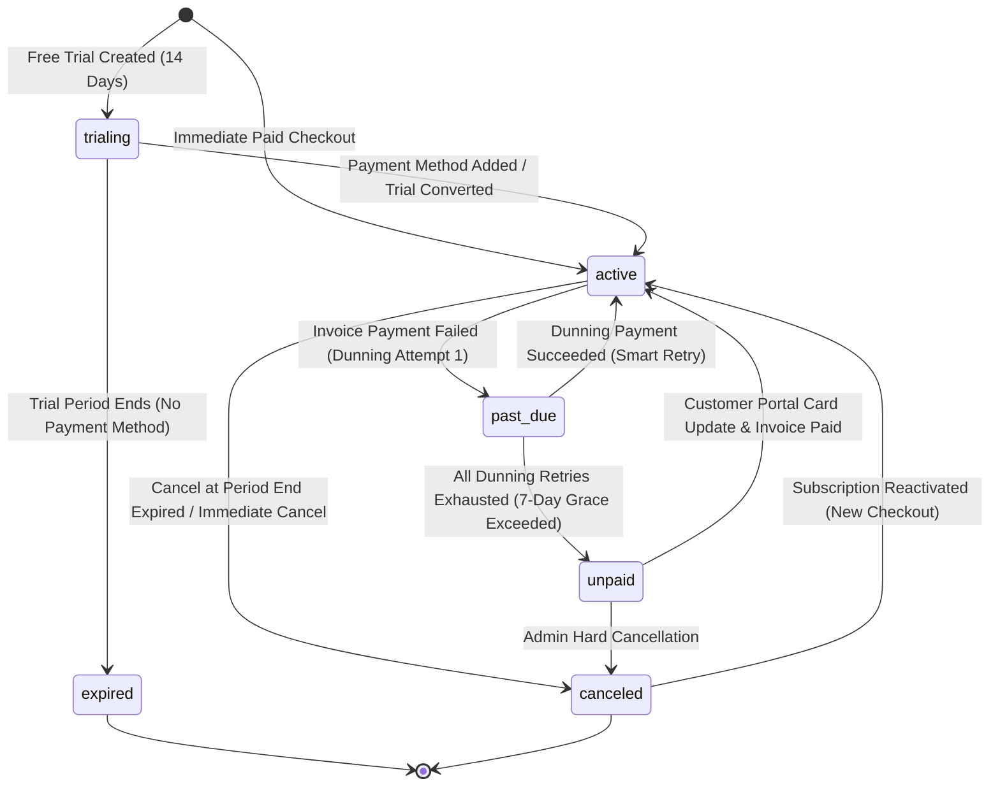

# Subscription Lifecycle & State Machine Specification
## AI Agency Operating System (AgencyOS)

---

## 1. Purpose

This document specifies the exact **Subscription Lifecycle State Machine** for AgencyOS, detailing state transitions, grace periods, dunning schedules, automated trial conversions, and reactivation workflows.

---

## 2. Architecture & State Machine Topology

The subscription lifecycle is driven by real-time events emitted from Stripe Billing and synchronized into PostgreSQL `subscriptions`.

---

## 3. Business Rules & State Descriptions

| Lifecycle State | Feature Entitlements | Access Policy | Dunning Action | Duration / Limit |
| :--- | :--- | :--- | :--- | :--- |
| **`trialing`** | Pro Tier Access | Full Access | N/A | 14 Days (No CC required) |
| **`active`** | Plan-specific Limits | Full Access | Normal Renewal Cycle | Monthly / Annual |
| **`past_due`** | Plan-specific Limits | Read-Only Warning Banner | Smart Retries (Days 1, 3, 5, 7) | 7-Day Grace Period |
| **`unpaid`** | Revoked (Freemium Level) | Locked out of Workspace | Card Update Required | Max 30 Days before Cancel |
| **`canceled`** | Revoked | Locked out | N/A | Terminal State |
| **`expired`** | Revoked | Free Tier Fallback | N/A | Terminal State |

---

## 4. Data Flow & Dunning Mechanics

### Dunning Schedule (7-Day Grace Period)
1. **Day 0 (Initial Failure)**: Event `invoice.payment_failed` received. State transitions to `past_due`. Customer receives automated email with update payment link.
2. **Day 1 (Retry 1)**: Stripe Smart Retry attempts charge.
3. **Day 3 (Retry 2)**: Second automated attempt + UI in-app warning toast.
4. **Day 5 (Retry 3)**: Third attempt + urgent admin email notice.
5. **Day 7 (Final Retry & Lockout)**: Final attempt fails. Event `customer.subscription.updated` fires with `status="unpaid"`. Workspace access is downgraded to read-only freemium mode.

---

## 5. Error Handling

- **Invalid State Transition Attempts**: Local Spring Boot state machine rejects out-of-order updates by checking current DB status against legal state transitions.
- **Race Condition Guard**: Database updates enforce optimistic locking using `@Version` fields on the `SubscriptionEntity`.

---

## 6. Security

- Status transitions are restricted to verified Stripe Webhook triggers or authenticated `ROLE_ORG_ADMIN` API calls.

---

## 7. Testing

- Test suite includes unit tests verifying state transitions for all 7 lifecycle states.
- Stripe CLI test script: `stripe trigger customer.subscription.updated` with mocked `status="past_due"`.

---

## 8. Monitoring

- Metric: `agencyos_subscriptions_active_count{plan}`
- Metric: `agencyos_subscriptions_past_due_count`
- Alert: `PastDueSubscriptionsSpike` (> 10 past due subscriptions within 1 hour).

---

## 9. Deployment

- State machine logic deployed as part of the core Spring Boot `billing-service` module.

---

## 10. Best Practices

- Always allow users a seamless self-service path in the Customer Portal to update failing payment methods during `past_due` states to maximize revenue recovery.
