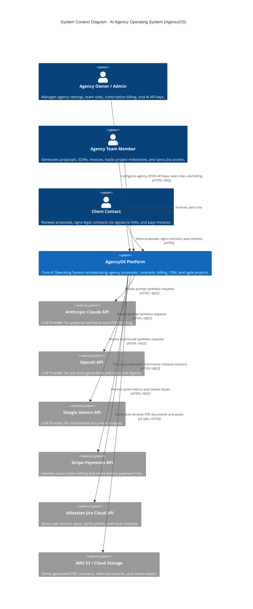

# Enterprise System Architecture Specification
## AI Agency Operating System (AgencyOS)

---

## 1. Executive Summary & Architectural Vision

The **AI Agency Operating System (AgencyOS)** is an enterprise-grade, multi-tenant SaaS platform built to automate the core workflows of digital, web development, and software engineering agencies. It integrates AI-driven proposal synthesis, legal Statement of Work (SOW) and contract generation with e-signature tracking, itemized client billing with Stripe, agile project milestone tracking, Jira sprint synchronization, and 360° client CRM directories.

The platform is designed around a modern hybrid architecture:
- **Frontend Layer**: Next.js 15 (App Router, React 19, TypeScript, Tailwind CSS with Glassmorphism UI & Light/Dark Theme Context).
- **Backend Service Layer**: Enterprise Spring Boot 3.2+ (Java 21 LTS) micro-services / modular monolith with Spring Security, Spring Data JPA, and Resilience4j.
- **Data Persistence**: PostgreSQL 16 for relational data and transactional consistency; Redis 7 for high-performance caching, session state, rate limiting, and real-time pub/sub.
- **AI Synthesis Pipeline**: Asynchronous Prompt Chaining Engine leveraging BYOK (Bring Your Own Key) routing across Anthropic Claude 3.5 Sonnet, OpenAI GPT-4o, and Google Gemini 1.5 Pro.

---

## 2. C4 High-Level System Architecture

### Context Diagram (Level 1)



---

### Container Diagram (Level 2)

```mermaid
C4Container
    title Container Diagram - AI Agency Operating System

    Container(spa, "Next.js 15 Web Application", "TypeScript, React 19, Tailwind CSS", "Delivers responsive UI, light/dark mode theme context, command palette, and reactive forms.")
    Container(cdn, "CloudFront / Vercel Edge", "CDN / Edge Cache", "Caches static assets, edge routes, and TLS termination.")

    Container(apiGateway, "API Gateway / NGINX", "NGINX / Spring Cloud Gateway", "Handles SSL termination, rate limiting, CORS policies, JWT validation, and routing.")
    Container(backendApp, "Spring Boot Core Backend", "Java 21, Spring Boot 3.2, REST API", "Executes business logic, RBAC security, proposal/invoice synthesis pipelines, and audit logging.")
    Container(aiEngine, "AI Prompt Engine Service", "Python / Java Async Worker", "Orchestrates multi-model prompt chaining, template injection, and streaming responses.")

    ContainerDb(postgresDB, "PostgreSQL 16 Database", "PostgreSQL", "Stores tenant organizations, users, clients, proposals, contracts, invoices, and audit trails.")
    ContainerDb(redisCache, "Redis 7 Cache & Queue", "Redis", "Caches user sessions, rate-limit buckets, API responses, and async background job queues.")

    Container(s3, "Amazon S3 Document Store", "AWS S3", "Encrypted storage for generated PDFs, contract e-signatures, and asset files.")

    Rel(spa, cdn, "Fetches static assets", "HTTPS")
    Rel(spa, apiGateway, "Makes REST & WSS API calls", "HTTPS / WSS (JWT)")
    Rel(apiGateway, backendApp, "Routes validated requests", "HTTP / gRPC")
    Rel(backendApp, aiEngine, "Dispatches prompt execution tasks", "Redis Queue / WSS")
    Rel(backendApp, postgresDB, "Reads/writes domain entities", "JDBC / JPA")
    Rel(backendApp, redisCache, "Reads/writes cache & locks", "Jedis / RESP")
    Rel(backendApp, s3, "Uploads and reads PDF contracts", "AWS S3 SDK")
  ```

---

## 3. End-to-End Sequence Diagram: Proposal & Invoice Generation Flow

```mermaid
sequenceDiagram
    autonumber
    actor User as Agency Team Member
    participant FE as Next.js 15 Client
    participant GW as API Gateway / Spring Security
    participant API as Proposal / Invoice Controller
    participant SVC as Synthesis Service
    participant AI as AI Prompt Engine (Claude/GPT-4)
    participant DB as PostgreSQL 16
    participant Cache as Redis 7 Cache

    User->>FE: Fills out Proposal Form & Clicks 'Generate Proposal'
    FE->>FE: Validates Client Name, Budget & Scope (Client-side validation)
    FE->>GW: POST /api/v1/proposals (Bearer JWT + Payload)
    GW->>GW: Validates JWT Signature & Rate Limit Bucket
    GW->>API: Forwards Request to ProposalController
    API->>DB: Stores Proposal Entity (Status: DRAFT)
    API->>SVC: Triggers generateProposalSynthesis(proposalId)
    
    SVC->>Cache: Checks for cached prompt templates
    Cache-->>SVC: Returns active prompt template
    SVC->>AI: Dispatches Prompt Payload to Claude 3.5 Sonnet API
    AI-->>SVC: Returns Generated MD Proposal Content (in 850ms)
    
    SVC->>DB: Updates Proposal (Content = MD, Status = GENERATED)
    SVC->>Cache: Invalidates organization proposal cache key
    API-->>GW: Returns HTTP 201 Created (Proposal DTO)
    GW-->>FE: HTTP 201 Created (JSON Response)
    FE->>FE: Renders Reactive Live Preview & Toast Notification
    FE-->>User: Displays Generated Proposal with PDF Download CTA
```

---

## 4. Non-Functional Requirements (NFR Targets)

| NFR Metric | Target Specification | Enforcement Mechanism |
| :--- | :--- | :--- |
| **Availability** | $99.95\%$ uptime ($< 4.38$ hours downtime / year) | Multi-AZ deployment on AWS ECS Fargate / Railway with automated health checks |
| **API Response Time** | $P_{95} < 150\text{ms}$ for CRUD; $P_{95} < 2500\text{ms}$ for AI generation | Redis 7 L2 response caching + Spring async execution threads |
| **Throughput** | $\ge 2,500$ RPM peak API requests per instance | Horizontal Auto-Scaling (CPU $> 70\%$ or Memory $> 80\%$) |
| **Security Standards** | OWASP Top 10, SOC 2 Type II compliant | AES-256 DB encryption at rest, TLS 1.3 in transit, bcrypt password hashing |
| **Database Scalability** | Up to 10M rows per table with zero degradation | PostgreSQL 16 B-Tree / GIN composite indexing + table partitioning by `organization_id` |
| **Accessibility** | WCAG 2.1 Level AA Compliance | Semantic HTML5, `role="progressbar"`, ARIA attributes, full keyboard navigation |
| **Core Web Vitals** | $LCP < 2.2\text{s}$, $INP < 90\text{ms}$, $CLS < 0.05$ | Next.js 15 Server Components, font optimization, static asset CDN caching |
