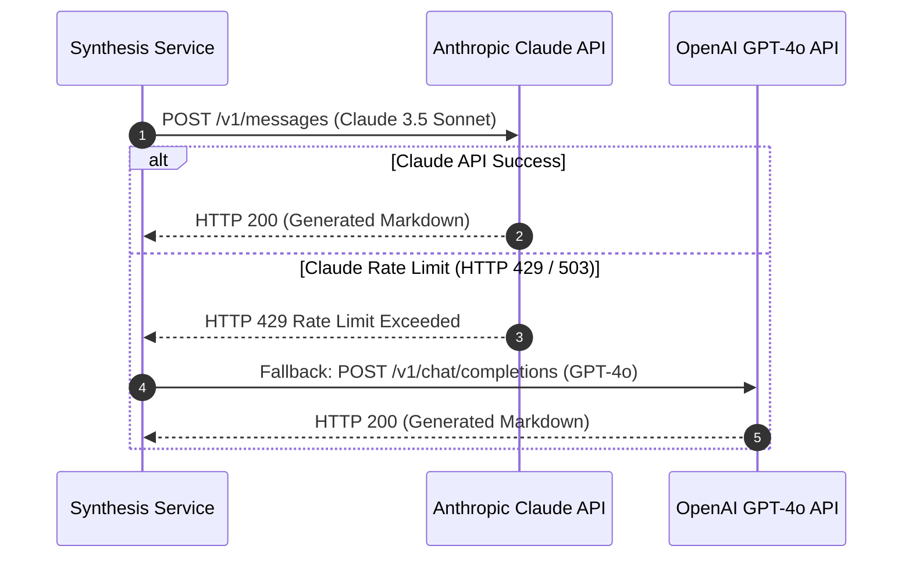

# Third-Party Integration Architecture Guide
## AI Agency Operating System (AgencyOS)

---

## 1. Integrations Overview & Authentication Summary

| Provider | Purpose | Authentication | Rate Limits & Fallback |
| :--- | :--- | :--- | :--- |
| **Anthropic Claude 3.5** | Proposal synthesis & legal SOW drafting | API Key / BYOK (`x-api-key`) | 50 RPM; Fallback to OpenAI GPT-4o |
| **OpenAI GPT-4o** | Jira story generation & executive digests | API Key / BYOK (`Bearer`) | 500 RPM |
| **Google Gemini 1.5** | Multimodal asset analysis & OCR | API Key / BYOK (`key=...`) | 60 RPM |
| **Stripe Payments** | Invoicing checkout & subscription management | API Key (`Bearer sk_live_...`) | Exponential backoff on 429 |
| **Atlassian Jira Cloud** | Sprint metrics & issue creation | Basic Auth (Email + API Token) / OAuth2 | 100 RPM per user |
| **Resend / SendGrid** | Transactional contract & invoice emails | API Key (`Bearer re_...`) | 100 emails / sec |
| **AWS S3** | Encrypted PDF & asset cloud storage | IAM Role / AWS Access Keys | Unlimited |

---

## 2. LLM Provider Routing Engine & Fallback Flow

